# AI-Faculty — Engineering Architecture Reference

> **Scope.** This document describes how the AI-Faculty application *actually works today*, as
> implemented in this repository. Every claim is traceable to a file and a symbol. Where an old
> implementation still exists but is no longer the active path, it is marked **LEGACY**. Where a
> behaviour is planned but not built, it is marked **NOT IMPLEMENTED**. Nothing here describes how the
> system "should" work.

> **How to read this.** Sections are numbered to match the documentation phases. Paths are relative to
> the repository root. Function/type names are given exactly as they appear in source so they can be
> searched.

---

## 0. Product summary

AI-Faculty (`package.json` `name: "ai-faculty-board"`) is an interactive AI teaching board. A student
types any educational question; a "teacher" answers it as **a multi-step lesson**, drawing on a live
**teaching board** while speaking the explanation aloud.

The teacher is a pool of LLM providers (Gemini → Groq → Mistral). The models **never** emit
React/HTML/CSS/WebGL/markdown. They emit a **structured lesson JSON** containing speech plus three
families of *semantic visual actions*:

| Family | Field | Renderer | Vocabulary type |
|---|---|---|---|
| Graph board | `board_actions` | `components/board/Board.tsx` (SVG) | `BoardAction` (`lib/board/types.ts`) |
| 2D diagram | `visual_actions` | `components/visual/DiagramRenderer.tsx` (SVG) | `VisualAction` (`lib/visual/types.ts`) |
| 3D scene | `visual3d_actions` | `components/visual3d/*` (React Three Fiber) | `Visual3DAction` (`lib/visual3d/types.ts`) |

Two deterministic engines compile those actions into **resolved scenes** with no randomness, and two
React renderers paint them. Speech is synthesised by a **client-side TTS provider** (Puter.js).

**Stack.** Next.js 15.1 App Router · React 19 · TypeScript 5.7 (`strict`) · `@google/genai`,
`groq-sdk`, `@mistralai/mistralai` · `three`, `@react-three/fiber` v9, `@react-three/drei` v10 ·
`puppeteer-core` (dev, for browser acceptance).

**Secrets.** `GEMINI_API_KEY`, `GROQ_API_KEY`, `MISTRAL_API_KEY` (plus `MISTRAL_MODEL`) live only in
`.env.local` and are read **server-side only** (`lib/teaching/providers/*`, `app/api/teaching/*`). They
are never logged, returned, or sent to the client. This document never prints a key.

---

## 1. Repository, tooling & conventions (discovery summary)

- **App framework:** Next.js 15.1 App Router (`app/`), React 19, no separate server. Server code is
  limited to Route Handlers under `app/api/teaching/*` (all tagged `export const runtime = "nodejs"`)
  plus the `lib/teaching/**` modules they import. Everything else is client (`"use client"`).
- **Path alias:** `@/*` → repo root (`tsconfig.json` `paths`). Tests compile via `tsconfig.test.json`
  (CommonJS → `.test-out/`) — that is why probes `require("../.test-out/lib/…/*.js")`.
- **Strictness:** `strict: true`, `noEmit` in the app config; the test config emits.
- **Conventions observed everywhere:**
  - Deterministic engines are UI-agnostic and topic-agnostic (`lib/board`, `lib/visual`,
    `lib/visual3d`) — no React, no randomness.
  - The AI never emits code/JSX/URLs; only validated semantic actions.
  - Server-side secrets never reach the client; `diagnostics.ts` logs sizes/counts only.
  - Behaviour is explained by long in-file comments; this document mirrors them.
- **npm scripts** (`package.json`): `dev`, `build`, `start`, `test` (6 unit suites), `assets:build`,
  `assets:validate`, `audit:assets`, `verify:browser`, `verify:board`, `verify:teaching`,
  `probe:lessons`.
- **Active vs non-active** (see the relevant sections): active TTS = Puter only; Graph/2D/3D action
  families are all active; `isOversizedStatus()` is a dead helper; `TeacherVoiceControls` is unused.

---

## 2. High-level architecture

Two request paths reach the model, plus a local path that never does:

- **Lesson batches** — `POST /api/teaching/lesson` (`app/api/teaching/lesson/route.ts`) asks for a
  *batch* of ~6 steps and continues until the objective is covered.
- **Interruption / follow-up** — `POST /api/teaching` (`app/api/teaching/route.ts`) asks for a *single*
  answer to a mid-lesson or post-lesson student question.

Both funnel into the same provider router (`lib/teaching/providers/router.ts`).

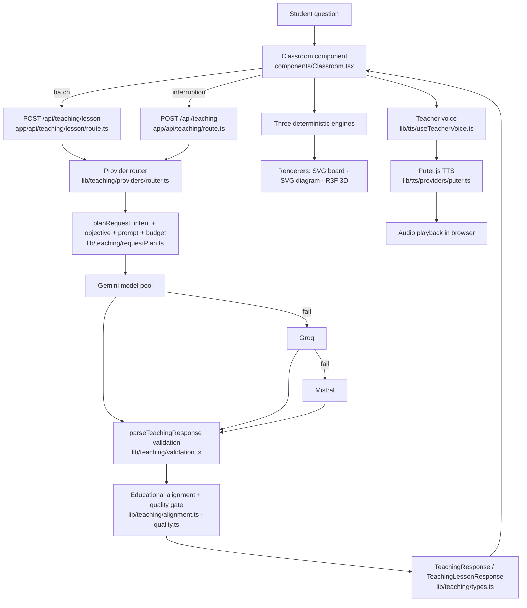

The **TTS path** is entirely client-side and independent of the teaching providers:

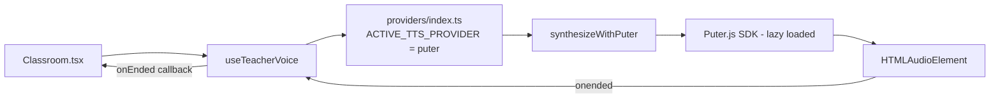

And the **client-side rendering path**, which is where a `TeachingResponse` becomes pixels:

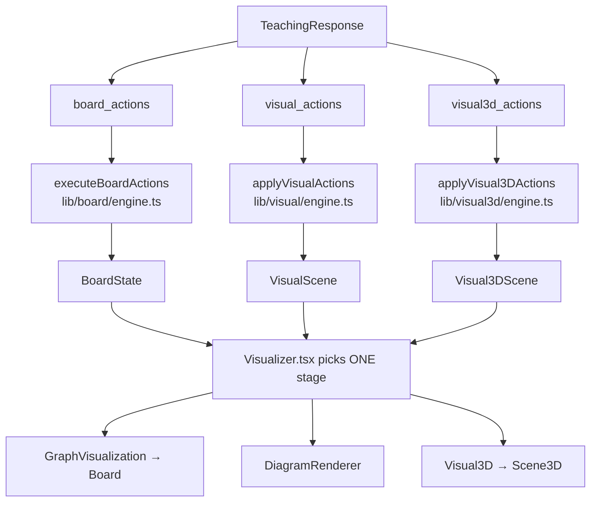

---

## 3. Complete request lifecycle (a student question, start to finish)

The authoritative client is `components/Classroom.tsx`. The real sequence below names the actual
functions.

1. **Student types a question** into `textarea#lesson-question` and presses Enter or clicks
   **Start Teaching** → `startTeaching()`.
2. **`startTeaching()`** trims the question, clears `teachingHistoryRef`, ends any previous
   continuous run (`endContinuous("stop")`), sets `continuousRef.current = true`, sets
   `lessonStarted = true`, resolves an explicit representation from the *wording* via
   `detectRepresentationIntent()` (unless the student already pressed 2D/3D), clears progress, and calls
   `requestTeachingLesson(true)`.
3. **`requestTeachingLesson(starting)`** builds the request body. For a new lesson it uses
   `emptyBoardState()` / `emptyVisualScene()` / `emptyVisual3DScene()`, `lessonStep = 1`; otherwise it
   sends the **live** scenes via `getBoardState()`, `getVisualScene()`, `getVisual3DScene()` so the
   model extends rather than restarts. The body also carries `previousTeaching`,
   `lessonProgress: progressRef.current`, and `representationIntent` (the button the student pressed, or
   `null` for Auto). It `POST`s to **`/api/teaching/lesson`**.
4. **Server: `app/api/teaching/lesson/route.ts` → `POST`.** It `await request.json()`, then
   `parseTeachingRequest(body)`. On failure → `400 INVALID_REQUEST` (with `describeTeachingRequestError`
   logged in development). If `NODE_ENV !== "production"` **and** the request names a scenario
   (`?scenario=` or `x-teaching-scenario`), the deterministic `scenarioResponse()` branch is taken
   (dev/acceptance only). Otherwise `generateTeachingLesson(lesson, { diagnostics })` runs.
5. **`generateTeachingLesson`** (`lib/teaching/providers/router.ts`) calls `run(lesson, "lesson", {})`.
6. **`run` → `planRequest(lesson, "lesson", schemaJson)`** (`lib/teaching/requestPlan.ts`):
   - `buildLessonObjective(request)` (`lib/teaching/objective.ts`) classifies intent
     (`classifyTeachingIntent`) and plans the ordered **stages**.
   - `resumeLessonProgress(objective, request.lessonProgress)` restores coverage from what the browser
     echoed back.
   - `buildPrompt(...)` is built at `full`, `compact`, `minimal` levels; `measureRequest` +
     `chooseLevel` select the most detailed level that fits `TOKEN_BUDGET` (`lib/teaching/budget.ts`).
   - The plan carries `objective`, `progress`, and the single `representation` ("2d" | "3d").
7. **Provider routing** (`run` → `tryGemini` → `tryGroq` → `tryMistral`), described fully in §5. The
   router returns `{ response, provider, geminiAttempts, latencyMs, plan }`.
8. **`generateTeachingLesson` post-processing**:
   - `renumberLessonSteps(steps, lesson.lessonStep)` rewrites `lesson_step`/`next_step` consecutively
     (the model's own numbering is not trusted).
   - **`alignAndJudge(lesson, numbered, plan.objective, plan.progress, plan.representation)`**
     (`lib/teaching/quality.ts`) runs the per-step education gate (§8) and returns aligned steps plus a
     `LessonQualityReport` (`logQuality` writes it to the log).
   - `applyStepsToProgress(plan.progress, judged.steps)` records coverage.
   - Returns `{ steps, progress: lessonProgressView(...), quality? }`, stamping each step with the
     lesson's `representation`.
9. **Server returns** the `TeachingLessonResponse` as JSON.
10. **Client: `requestTeachingLesson`** parses the payload, checks
    `stepRequestIdRef.current === requestId` (stale responses are discarded), stores the batch in
    `lessonStepsRef` (a `Map` keyed by `lesson_step`), stores `progress` in `progressRef`/`progress`,
    learns `representation` (only while in Auto), `prefetchTeacher(...)` queues up to 4 speeches, then
    calls **`playStoredLessonStep(first)`**.
11. **`playStoredLessonStep(step)`** — the client applies one step:
    - arms the sync watchdog (`watchdogRef`),
    - `setSpeech(step.speech)`, appends to `teachingHistoryRef`,
    - snapshots the scene **before** (`sceneBeforeStepRef`),
    - `setBoard(executeBoardActions(...))`, `setVisualScene(applyVisualActions(...))`,
      `setVisual3dScene(applyVisual3DActions(...))`,
    - `playQueuedTeacher(lessonId, step.lesson_step)` starts TTS,
    - prefetches the next up-to-3 cached steps.
12. **TTS plays** (§12). When the audio fires `onended`, `useTeacherVoice` calls `onEnded`, which is
    wired to `advanceRef.current` → **`advanceContinuous()`**.
13. **`advanceContinuous()`** plays the next **cached** step (`lessonStepsRef`), or — if the batch is
    exhausted — calls `requestTeachingLesson()` for the next batch (guarded by
    `inFlightIdRef.current !== null` so exactly one batch is in flight).
14. **Next step prepared / lesson continues** until either the objective is covered (server marks
    `progress.complete`) or a stop condition fires.
15. **Lesson completion is derived on the client**, never asserted by the provider:
    `deriveLessonState({ progress, deliveredSteps, activeStep })` in `lib/teaching/objective.ts` chooses
    the phase `"teaching" | "objective-covered" | "complete"`.

**Interruption** (Ask box) is a *separate* path: `askQuestion()` → `POST /api/teaching` →
`generateTeachingStep` → a single aligned `TeachingResponse`, applied without touching lesson step
state (§13).

**Failure** at any stage maps to the failure matrix in §15.


---

## 4. Lesson engine

The lesson engine is split across `lib/teaching/objective.ts` (authoritative plan & progress),
`lib/teaching/providers/router.ts` (batching), and `components/Classroom.tsx` (playback).

### 4.1 Terminology (exact, from the code)

- **Lesson** — teaching one focused topic, delivered as many *steps* until the **objective** is covered.
  It is NOT a batch, a timer, or a provider flag (`objective.ts` header comment).
- **Objective** (`LessonObjective`) — the ordered list of **stages** the lesson must teach, plus
  `minSteps`, `maxSteps`, `batchSize`. Built by `buildLessonObjective()`.
- **Stage** (`TeachingStage`) — one pedagogical unit with `id` (`"s3"`), `kind` (`StageKind`), `title`,
  `goal`, `minWords`, `needsVisual`, `needsCode`. Stage kinds include `prerequisite`, `intuition`,
  `concept`, `terminology`, `notation`, `visual`, `example`, `advanced`, `mechanics`, `code`,
  `walkthrough`, `execution`, `complexity`, `mistakes`, `application`, `recap`.
- **Step** (`TeachingResponse`) — one teaching turn: `speech` + the three action arrays +
  `lesson_step`/`next_step` (+ optional `stage_id`, `representation`).
- **Batch** — the group of steps one request returns. `batchSize` is **6** for a deep lesson, **1** for
  a brief request.

### 4.2 How many steps are generated

`buildLessonObjective` sets `batchSize` and bounds:

```ts
minSteps: brief ? 1 : Math.max(6, Math.ceil(stages.length / 2)),
maxSteps: brief ? 2 : 60,
batchSize: brief ? 1 : 6,
```

Depth is decided by `detectDepth()` in `lib/teaching/intent.ts`: **deep is the default**; a request is
`brief` only when it *explicitly* asks for a short answer (`EXPLICIT_SHORT_PATTERNS`, a `define …`
prefix, or pure arithmetic via `isArithmeticOnly`).

### 4.3 How the next batch is generated

`advanceContinuous()` asks again from the current scene. Because the request echoes `boardState`,
`visualState`, `visualState3d`, `previousTeaching`, and `lessonProgress`, each batch extends the same
lesson. The prompt's section F (`objectiveSection` in `lib/teaching/prompt.ts`) tells the model the
**remaining** stages and `TEACH NOW: <stage>`.

### 4.4 How cached steps work

The client keeps the whole batch in `lessonStepsRef` (a `Map<number, TeachingResponse>`). `advanceContinuous` and
`goToStep(+1)` read from that map first; a batch is only re-fetched when the map has no next step. TTS
for the next up-to-4 steps is prefetched into the voice queue (`prefetchTeacher`).

### 4.5 Stage progression & coverage

Coverage is measured from **delivered teaching speech**, not from the provider's `stage_id`:

- `stageForStep(progress, step, covered, cursor)` credits a step to the stage it declares **if that
  stage is still uncovered**; otherwise it credits the current cursor stage (so a provider repeating a
  stale `stage_id` cannot loop — see the comment about a 24-step Newton run).
- `applyStepsToProgress(progress, steps)` adds the step's `wordCount` to `stageWords[stage]` and marks
  the stage covered once `>= stage.minWords` (30 words deep / 20 brief). It advances the cursor and
  increments `stepsDelivered`.

### 4.6 Lesson completion (authoritative definition)

`isObjectiveComplete(progress, objective)` in `objective.ts`:

```ts
if (progress.stepsDelivered >= objective.maxSteps) return true;   // hard safety stop
if (progress.stepsDelivered <  objective.minSteps) return false;  // too short to be a lesson
return progress.stages.every((stage) => progress.coveredStageIds.includes(stage.id));
```

`lessonProgressView(progress, objective)` publishes the browser-facing `LessonProgressView`
(`stages`, `coveredStageIds`, `remainingStageIds`, `currentStageId`, `stepsDelivered`, `minSteps`,
`maxSteps`, `complete`).

### 4.7 The ONE authoritative client lesson state

`deriveLessonState()` produces `LessonState` and resolves the contradictions between "the objective is
covered" and "the student still has steps to step through":

```ts
stagesComplete      // every planned stage taught
objectiveComplete   // progress.complete from the server
remainingCachedSteps// deliveredSteps - activeStep
canFetchMore        // !objectiveComplete
phase               // "objective-covered" | "complete" | "teaching"
nothingLeft         // complete AND no cached steps left AND a step is on screen
```

The client maps this to UI: `phase === "complete"` → "Lesson complete";
`phase === "objective-covered"` → "Topic covered — N more steps you can still step through";
`nothingLeft` → the "Start a new lesson" button.

### 4.8 Interruptions, Replay, Back, Next, Reset

- **Interruption** — `askQuestion()` (§13). Does **not** move `activeLessonStepRef`; speaking the answer
  re-raises `onEnded`, so a mid-lesson interruption resumes continuous teaching.
- **Replay** — `replayCurrentStep()`: restores `sceneBeforeStepRef.get(step)` and lets
  `pendingReplayRef` re-apply the step on the next commit (so incremental actions never duplicate).
- **Back** — `navigateSteps(-1)` → `goToStep(-1)`: restores `sceneAfterStepRef.get(current-1)` and its
  stored speech, stops continuous mode.
- **Next** — `navigateSteps(1)` → `goToStep(+1)`: available as soon as the next step **exists** in the
  cache; a played step is restored from `sceneBeforeStepRef`, an unplayed one is applied to the current
  scene.
- **Reset / new lesson** — `startNewLesson()`: stops teaching, clears `lessonStepsRef`, history and
  progress, empties all three scenes, forgets the lesson representation, **keeps** a student-chosen
  view mode, and returns to the setup form.


---

## 5. AI provider system

All providers live in `lib/teaching/providers/`. Routing order is **Gemini → Groq → Mistral**, exactly
as written in `router.ts` (`run` → `tryGemini` → `tryGroq` → `tryMistral`).

### 5.1 Shared provider primitives

**`lib/teaching/providers/error.ts`**

- `ProviderError` — `{ provider, status?, transient, configuration }`.
- `isTransientStatus(status)` — `408 | 429 | 5xx`.
- `statusOf(error)` — best-effort HTTP status extraction from SDK error shapes.
- `asProviderError(error, provider)` — classifies an unknown error; a known status classifies by status,
  otherwise a `TypeError` or a network/availability message (`NETWORK_OR_AVAILABILITY`) is transient.
- `withProviderTimeout(provider, description, ms, run)` — a **hard wall-clock cap** via `Promise.race`;
  on expiry throws a transient `504`. This exists because SDK timeouts were observed not to fire (a
  15-minute hang was observed).

### 5.2 Gemini — PRIMARY (`lib/teaching/providers/gemini.ts`)

- **SDK:** `@google/genai` (`GoogleGenAI`, `Type`).
- **Model pool:** `GEMINI_TEACHING_MODELS` (ordered by measured availability; flash-lite first).
  `availableGeminiTeachingModels()` returns the ids the key can actually call.
- **Schema:** `geminiTeachingSchema` (single step), `geminiTeachingLessonSchema` (batch) — native
  `@google/genai` `Type` enums, requested via `responseSchema` + `responseMimeType: "application/json"`.
- **Timeouts:** `REQUEST_TIMEOUT_MS` (`GEMINI_TIMEOUT_MS`, default 20 000) per step; the router applies
  `GEMINI_LESSON_TIMEOUT_MS` (~90 000) for a batch.
- **Structured output:** response text is `JSON.parse`d → `parseTeachingResponse` /
  `parseAllTeachingSteps`. Invalid output → **one bounded repair retry** using `repairTurn(raw)`
  (`lib/teaching/providers/repair.ts`); still invalid → transient `502`.
- **Health / cooldown:** `lib/teaching/providers/health.ts` — 404 permanently disables a model
  (`markGeminiModelUnavailable`, re-probed after `DISABLED_MODEL_TTL_MS` = 6h); 429 → 90 s cooldown;
  503 → 15 s cooldown; success clears it and remembers the winning model as `preferredModel`.

### 5.3 Groq — FALLBACK (`lib/teaching/providers/groq.ts`)

- **SDK:** `groq-sdk`. **Model:** `GROQ_TEACHING_MODEL` (`GROQ_TEACHING_MODEL` env or default
  `openai/gpt-oss-120b`); `GROQ_TEACHING_FALLBACK_MODELS` = `["openai/gpt-oss-20b"]`.
- **Schema:** the shared JSON Schema in `lib/teaching/providers/jsonSchema.ts`
  (`jsonTeachingSchema`, `jsonTeachingLessonSchema`), requested as `response_format: { type:
  "json_schema", … }`. If Groq rejects `json_schema` with a `400`, the module latches
  `preferJsonObjectMode` for the process and retries with `{ type: "json_object" }`.
- **Prompt:** reuses the same `plan.system`/`plan.user` plus `JSON_MODE_INSTRUCTIONS`.
- **Same validation + one repair retry** as Gemini.

### 5.4 Mistral — THIRD / FINAL (`lib/teaching/providers/mistral.ts`)

- **SDK:** `@mistralai/mistralai` (`Mistral`). **Model:** `MISTRAL_TEACHING_MODEL` (`MISTRAL_MODEL` env
  or default `mistral-small-latest`).
- **Timeout:** `MISTRAL_TIMEOUT_MS` (default 30 000), applied both to the SDK call and via
  `withProviderTimeout`.
- **JSON recovery:** `extractJsonPayload(content)` unwraps ```json fences and prose-wrapped objects
  before parsing — so a fenced answer is *recovered*, not failed over.
- **Same validation + one repair retry.** `json_schema` is attempted then degraded to `json_object`.

### 5.5 Model availability discovery

`availableGeminiTeachingModels()` in `gemini.ts` calls the live model list and returns only callable
ids; the router tries `getPreferredGeminiModel()` first, then the rest. A 404 disables a model for the
process.

### 5.6 Routing behaviour matrix

| Provider outcome | Router behaviour |
|---|---|
| **Success** (valid, parseable) | Return it. `recordGeminiSuccess` (Gemini). |
| **Malformed JSON** | `JSON.parse` throws → transient `502` → next model/provider. |
| **Schema-invalid output** | One `repairTurn` retry on the **same** model, then transient `502` → next. |
| **404 (model not found)** | Gemini: `markGeminiModelUnavailable`, never retried. Others: `502`. |
| **429** | Record failure (90 s cooldown for Gemini) → next model, then next provider. |
| **5xx / timeout** | Classified transient → next model/provider. `withProviderTimeout` → `504`. |
| **413 / "too large"** | Groq/Mistral: **compact** the plan (`replan`) and retry **once per level**
  (full → compact → minimal), never re-sending the oversized request unchanged. |
| **Gemini time budget** (`GEMINI_TIME_BUDGET_MS`, default 45 s) exceeded | Stop trying Gemini; go to
  Groq. |
| **Whole-ladder deadline** (`TEACHING_REQUEST_DEADLINE_MS`, default 150 s) exceeded between providers |
| Throw transient `504` "no provider answered within the time budget". |
| **All providers fail** | `run` throws `ProviderError`; route → `502 TEACHING_SERVICE_ERROR`. |
| **No key configured at all** | `503 TEACHING_SERVICE_UNAVAILABLE` (with `configuration: true`). |

### 5.7 Development fault injection (never active in production)

`lib/teaching/providers/devSimulation.ts`: `readTeachingSimulation(request)` returns `{}` unless
`NODE_ENV !== "production"`. Faults are supplied per-request via headers
`x-teaching-simulate-gemini|groq|mistral` and route through `simulateGemini/Groq/Mistral`. Fault kinds
include `sample`, `unavailable`, `rate-limit`, `invalid-response`, `oversized`, `retry-success`,
`fenced-json`. Every simulated payload is still pushed through the shared validator (`validated()`).

**LEGACY / non-active:** `isOversizedStatus()` in `router.ts` is a dead helper — its body returns
`false` for every input (`if (status === 400 && false) return false;`). The live oversized detection is
inline in `tryGroq`/`tryMistral` (`status === 413 || (status === 400 && /too large|…/)`).


---

## 6. Prompt construction & visual vocabulary

Prompt assembly is `buildPrompt()` in **`lib/teaching/prompt.ts`**. It produces a `BuiltPrompt`:
`{ system, user, assets, state, recentSpeech, level, representation, stateChars, speechChars }`.

### 6.1 The request context (`lib/teaching/context.ts`)

`compactState(request, level)` reduces the live `BoardState` + `VisualScene` + `Visual3DScene` to a
bounded, renderer-free summary (nodes/edges/texts, diagram objects, 3D objects + flows + labels +
camera mode, all capped). `recentSpeech()` keeps the last N speeches (bounded). `sceneAssetIds()` and
`spokenAssetIds()` pin assets already on screen or named in speech so a lesson never loses its models.

### 6.2 System prompt

The `system` string is assembled from:

- **Family guide** — `FAMILY_INTRO` plus only the vocabulary sections the lesson can use.
- **Rules** — `CORE_RULES`, `representationLadderRules(catalogModels)`, and (only when the 3D family is
  in scope) `SCENE3D_RULES`; `DIAGRAM_RULES` always.
- **A stage line** — `THIS LESSON IS SHOWN ON THE 3D STAGE…` or `…2D BOARD…`, telling the model which
  family is visible so it does not write into a family that will be deleted.
- **A before-you-write check** — the two most common teaching failures (opening announcement, recap
  without a summary) are stated as concrete before/after examples.

### 6.3 Topic-scoped vocabulary (`visualFamiliesFor`)

Vocabulary is **deterministically scoped** — no extra model call:

```ts
export function visualFamiliesFor(input): { graph, diagram, scene3d }
```

- `graph` is off for non-structural subjects (`mathematics`, `physics`, `chemistry`, `humanities`).
- `diagram` is always on.
- `scene3d` is on only when the student asked for 3D (`representationIntent === "3d"`) **or** the asset
  catalogue found at least one relevant 3D model (`relevant3dAssets > 0`); an explicit 2D choice
  (`explicitTwoDimensional`) forces it off.

`assetsForQuestionOnly(request)` counts catalogue matches **from the question alone** — deliberately
blind to the live scene and prior speech, because deciding from those made the stage flip mid-lesson.

### 6.4 Representation selection (one decider)

`representationForRequest(request, subject)` → `lessonRepresentation(...)` → `visualFamiliesFor(...).scene3d`
? `"3d"` : `"2d"`. The classroom, the prompt and the alignment gate all agree because they call this one
function (or the same `plan.representation`).

### 6.5 Asset catalogue context (`lib/teaching/assetSelection.ts`)

`selectAssetsForLesson(question, options)` scores every registry asset against the question tokens (and
optionally recent speech), pins scene assets (+1000), zeroes off-subject matches when the wording names
a single subject (`subjectOfVocabulary`), and returns a bounded `AssetSelection`. The prompt shows the
top matches with their semantic parts (`assetCatalogText`) plus a one-line-per-category index of the
whole library (`libraryIndexText`), so the model is aware of all models without a full entry each.

### 6.6 Request planning & compaction (`lib/teaching/budget.ts`, `requestPlan.ts`)

`estimateTokens` is deliberately pessimistic (`chars / 3.5`). `measureRequest` sums system + user +
schema tokens. `chooseLevel` picks `full` if `<= TOKEN_BUDGET` (7000), else `compact`, else `minimal`
if `<= TOKEN_HARD_LIMIT` (7700), else fails. `planRequest` builds all three and keeps the most detailed
that fits; `replan` steps down one level after an oversized rejection, preserving objective/progress.

### 6.7 User prompt sections

`user` is assembled as: **D** current state + recent speech, **C** asset catalogue, **E** the question
(plus the student's interruption when present), **F** the objective (`objectiveSection`). `level`
controls how much of D and F survives and how small the catalogue gets (full > compact > minimal).

`teachingLessonPrompt(request, options)` appends `LESSON_INSTRUCTIONS` (the batch format), and
`teachingSystemPrompt` / `TEACHING_SYSTEM_PROMPT` expose the system text for tooling/tests.


---

## 7. Structured lesson contract

The canonical types are in **`lib/teaching/types.ts`**. The **authoritative validator** is
`parseTeachingResponse` / `parseAllTeachingSteps` in `lib/teaching/validation.ts` — every provider's
output must pass it before the classroom sees anything.

### 7.1 `TeachingResponse` (one step)

```jsonc
{
  "speech": "Blood enters the right atrium through the vena cava…",   // required, non-empty string
  "board_actions": [],              // optional, Graph family (BoardAction[])
  "visual_actions": [],             // optional, 2D family (VisualAction[])
  "visual3d_actions": [             // optional, 3D family (Visual3DAction[])
    { "action": "create_3d_object", "id": "heart", "type": "model", "asset": "biology/heart" },
    { "action": "frame_camera" }
  ],
  "lesson_step": 1,                 // required integer
  "next_step": 2,                   // required integer
  "stage_id": "s3",                 // optional
  "representation": "3d"            // optional, stamped by the pipeline
}
```

**Required fields:** `speech`, `lesson_step`, `next_step`. Every action family is optional (a step may
drive any renderer — or none).

### 7.2 A 2D structure step

```jsonc
{ "action": "create_array", "id": "arr", "values": ["10","20","30","40"], "indices": true }
```

### 7.3 A code step

```jsonc
{ "action": "create_code_block", "id": "code", "code": "for (i=0;i<n;i++) {\n  …\n}",
  "language": "cpp", "title": "search.cpp", "highlightLines": [2] }
```

### 7.4 A 3D structure step

```jsonc
{ "action": "create_3d_object", "id": "nucleus", "type": "sphere", "scale": 0.6,
  "placement": { "kind": "relation", "relation": { "type": "inside", "objects": ["cell"] } } }
```

### 7.5 Lesson batch (`TeachingLessonResponse`)

```jsonc
{ "steps": [ /* TeachingResponse[] */ ],
  "progress": { /* LessonProgressView, when present */ },
  "quality": { /* LessonQualitySummary, only when ?diagnostics=1 */ } }
```

### 7.6 Validation, repairs, dropped vs accepted

- Board actions are validated all-or-nothing per step (`parseBoardAction`; a null board action rejects
  the step) — `parseTeachingResponse`.
- **2D actions are repaired per action** via `repairVisualActions(value.visual_actions)`; each repaired
  or dropped action is logged (`logVisualContract`, `diagnostics.ts`) with its reason.
- **3D actions** are validated via `parseVisual3DActions`; if the array is invalid the step is rejected.
- **A malformed step in a batch is dropped, not the batch** — `parseAllTeachingSteps` keeps the valid
  steps (`describeMalformedLessonSteps` reports the reason in dev logs). A dropped step simply leaves
  its stage for the next batch.
- `parseTeachingRequest` accepts the request contract, defaults absent optional arrays, clamps
  `previousTeaching` to the last 8, and drops an unparseable `lessonProgress` rather than failing.

### 7.7 Interruption response

The interruption endpoint returns a plain `TeachingResponse` (no `steps` array). It goes through the
same `alignAndJudge` gate (see §8) before it is returned.

Key files: `lib/teaching/types.ts`, `lib/teaching/validation.ts`, `lib/board/types.ts`,
`lib/visual/types.ts`, `lib/visual3d/types.ts`, `lib/teaching/providers/jsonSchema.ts`.


---

## 8. Visual alignment / quality pipeline

This is the gate between **AI-generated visual actions** and **actual rendered visuals**. Schema
validation only proves a response is *well formed*; this proves it *teaches*. It lives in
`lib/teaching/alignment.ts` (per-step alignment) and `lib/teaching/quality.ts` (batch verdict).

Pipeline:

```
AI visual_actions / visual3d_actions / board_actions
  → lib/teaching/validation.ts        (parse + per-action repair; logVisualContract)
  → lib/teaching/alignment.ts         (alignTeachingStep: 7 rungs of the degradation ladder)
  → lib/teaching/quality.ts           (alignAndJudge: alignment + issue detection → LessonQualityReport)
  → accepted TeachingResponse.steps
  → lib/{visual,visual3d,board}/engine.ts → scene
  → renderer
```

### 8.1 `alignTeachingStep(step, context)` — the degradation ladder

`AlignmentContext` carries the question, topic, subject, `deep`, the single `representation`, the live
3D/diagram/board ids, and the step's `stageKind`. Each rung is derived only from the registry vocabulary
and the teacher's own words (`lib/teaching/concepts.ts`):

0. **Representation enforcement.** The stage shows ONE family. Actions written into the *hidden* family
   (and `board_actions` during a 3D lesson) are dropped with reason "…would never be seen". If that
   empties the step, a later rung rebuilds it in the visible family.
1. **Promote generic primitive → real model.** A `create_3d_object` whose object phrase names a real
   asset (`assetForPhrase`) is promoted to `type:"model"` with that asset ("`heart_model` as a box
   becomes `biology/heart`"). A `model` with no resolvable asset is **dropped** (it would be a dead
   action). An unpromotable primitive gets a label (`labelFromId`) so it never ships unlabelled.
2. **Category scoping / destructive-action protection.** An asset from a subject other than the lesson's
   is dropped (`SUBJECT_CATEGORY`), *unless* dropping it would leave the step empty. A `clear_3d_scene`
   followed by nothing (a pure wipe) is dropped.
3. **Part validation.** `isolate_part` / `set_visibility` / `explode_group` parts that are not in the
   asset's `semanticAnchors` are removed (the action is retargeted or dropped), so no action silently
   changes nothing.
4. **Target validation / retargeting.** An action addressing a non-existent object is dropped; when
   exactly one existing object is unambiguously the intended one it is **retargeted**
   (`resolveUnknownObject`). A structure **mutator of the wrong kind** (e.g. `update_array` aimed at a
   stack) is dropped via `wrongStructureKind`.
5. **Label what the teacher names.** For a deep lesson, every semantic part the speech mentions gets a
   `show_3d_label` (bounded, deduped) — the board names what the speech names.
6. **Empty-board protection.** Only when *nothing teaching-relevant* reached the board
   (`nothingAtAll || onlyBarePrimitives`) does `representationFromSpeech(step.speech, …)` build a
   **simplified representation from the teacher's own words** — never an unrelated one. Its rungs:
   the real registry model (`bestAssetFor`) if the student is not already looking at it; a spoken
   sequence (`exchangeParties`), comparison (`shape === "contrast"`), pipeline of enumerated steps, or
   the run of calls the teacher walked through (`calledSequence`); otherwise a labelled marker; else
   **text-only** and the report says so.
7. **Put the taught entity on the board.** For a deep 3D lesson, if the teacher spends a step naming a
   registry-backed thing of this lesson's subject that is not on screen, its validated model is added
   (bounded, no duplicates). A step that changed the 3D scene and focused one object also gets a
   trailing `frame_camera` so nothing it changed is left off screen.

### 8.2 `StepAlignmentReport`

Per step: `promoted`, `dropped` (family + action + reason), `repaired`, `labelsAdded`,
`representationAdded`, `entitiesNamed` (from the **question/topic** only), `entitiesShown`,
`speechEntities`, `visualChanged`, `unbackedSpeech`, `notes`. `entitiesNamed` deliberately only counts
what the *student asked about* — a passing mention of another organ is not a promise to model it.


### 8.3 `alignAndJudge(request, steps, objective, progress, representation)` — the verdict

`lib/teaching/quality.ts`. It runs `alignTeachingStep` over the batch, **replaying** each aligned step's
objects into `known3d`/`known2d`/`knownBoard` so a later step in the same batch can legitimately refer
to an object an earlier step created. It then builds a `LessonQualityReport`.

### 8.4 Quality issues (`stepIssues`)

The verdict is conservative and always returns reasons (`TeachingQualityIssue.kind`):

- **`meta-narration`** — a sentence that talks *about* the lesson (`META_NARRATION` patterns:
  "as we move forward", "you are now ready", …).
- **`repetition`** — content-word overlap `> 0.82` with everything said so far, or `> 0.85` with any of
  the last 3 steps (`contentWords`/`overlapRatio`).
- **`thin-step`** — for a deep lesson, `< 60%` of the stage's `minWords`.
- **`unbacked-visual`** — the speech matches `VISUAL_CLAIM` but `visualChanged` is false, **or**
  `report.unbackedSpeech` (the speech names real entities and the board shows none), or names ≥2 and
  shows fewer than half.
- **`visual-stagnation`** — two consecutive steps left the board unchanged.
- **`no-conclusion`** — a deep lesson whose recap stage produced no summarisable line (found by
  `stage_id`, not position).

`ok = severe.length === 0` (every kind except `no-conclusion`). `LessonQualityReport` also carries
`words`, `visualSteps`, `entitiesNamed`, `entitiesShown`, `modelledEntities`, `promotedPrimitives`,
`labelsAdded`, `substitutions`, `droppedActions`, `perStep`.

`summariseQuality(report)` renders a one-line credential-free summary used by `logQuality` in the
router and by `?diagnostics=1` responses.

### 8.5 Where alignment is invoked

- `generateTeachingLesson` → `alignAndJudge(...)` over the batch (router).
- `generateTeachingStep` → `alignAndJudge(...)` over the single interruption response (router).
- `scenarioResponse` (dev/acceptance) → `alignAndJudge(...)` so a deterministic scenario is measured by
  the same gate as a live lesson.

### 8.6 Real behaviours this pipeline implements

| Behaviour | Implemented by |
|---|---|
| primitive → trusted model promotion | Rung 1 (`assetForPhrase`) |
| unrelated model removal | Rung 2 (`SUBJECT_CATEGORY`) |
| invalid target removal | Rung 4 (`requiredIds3d`/`requiredIds2d` + `known*`) |
| mistyped object retargeting | Rung 4 (`resolveUnknownObject`, `wrongStructureKind`) |
| missing labels | Rung 5 (`partsMentioned` + `show_3d_label`) |
| simplified representation generation | Rung 6 (`representationFromSpeech`) |
| destructive-action protection | Rung 2 (`clear_3d_scene` / `clear` wipe drop) |
| empty-board protection | Rung 6 (`nothingAtAll` / `onlyBarePrimitives`) |
| one-family-per-lesson | Rung 0 (`context.representation`) + `plan.representation` stamp |


---

## 9. 2D visual system

The 2D system is a **deterministic reducer + a pure renderer**. Given the same ordered actions it always
produces the same board (`lib/visual/engine.ts` header).

### 9.1 Semantic actions (`lib/visual/types.ts`)

The model emits `VisualAction`s — never coordinates it must compute. Two tiers:

- **Semantic structures** (`SEMANTIC_STRUCTURE_ACTIONS`): `create_array`, `update_array`,
  `create_linked_list`, `create_stack`, `create_queue`, `create_tree`, `create_graph`,
  `create_sequence`, `create_pipeline`, `create_timeline`, `create_compare`, `create_code_block`,
  `set_code_pointer`. Payloads are structural (values/order/relations), not positional.
- **Primitives & edits:** `create_shape`, `create_text`, `create_label`, `create_icon`, `create_arrow`,
  `create_connector`, `create_container`, `move`, `resize`, `rotate`, `highlight`, `highlight_many`,
  `focus`, `dim`, `restore`, `pulse`, `fade_in`, `fade_out`, `flow`, `animate_path`, `write_formula`,
  `set_theme`, `wait`, `remove`, `clear`, `camera_focus`.

Supporting vocabularies: `SHAPE_KINDS`, `SEMANTIC_KINDS`, `VISUAL_ROLES`, `VISUAL_THEMES`, `ANCHORS`,
`RELATIVE_SIDES`, `ANIMATION_KINDS`, `ARROW_STYLES`, `CONNECTOR_KINDS`. Bounds: `DIAGRAM_WIDTH = 800`,
`DIAGRAM_HEIGHT = 520`, `MAX_OBJECTS = 120`, `MAX_VISUAL_ACTIONS_PER_STEP = 72`, `MAX_TEXT_LENGTH = 240`.

### 9.2 The pipeline: semantic action → geometry → scene → renderer

`applyVisualActions(scene, actions)` → `applyVisualActionsDetailed(...)` runs seven stages:

1. **LOWER** — `lowerVisualActions(scene, actions)` compiles each semantic structure into ordinary
   primitives with computed coordinates (`compileStructure` → `lib/visual/layout.ts`). Anything that
   does not fit the `MAX_OBJECTS` budget is repaired (partial) and diagnosed.
2. **REDUCE** — `buildTimeline(actions)` (`lib/visual/timeline.ts`) assigns each action a start time
   (from `wait` + per-action `delayMs`); actions run in order through `applyVisualAction`.
3. **MEASURE** — shapes grow to fit their own label (`shapeSizeForText`, `measure.ts`); text is measured,
   not assumed.
4. **DETECT** — connections re-derive their extent from live endpoints (`refreshConnections`).
5. **ADJUST** — overlapping objects are separated along the axis of least penetration
   (`resolveSceneOverlaps`).
6. **PLACE** — labels follow the object they name; free text takes a free spot (`refreshTextPlacement`).
7. **REROUTE** — connection lanes are re-chosen so no label lands on a shape or another label
   (`refreshConnectionLabels`).

`applyVisualAction` itself is a pure switch. `skipReason(action, scene)` (judged **before** the action
runs) records why an action had no effect — duplicate id, missing `from`/`to`, missing `target`,
`move` without a placement — as a `VisualActionDiagnostic`.

### 9.3 Geometry & layout

- **`lib/visual/geometry.ts`** — `VIEWPORT`, `boxOf`/`boxOfObject`, `boxesOverlap`, `clampCenter`,
  `resolvePlacement` (anchors → slots; `findFreeSpot` deterministic spiral; `between`), lane allocation
  (`connectionsBetween`, `nextLaneOffset`, `fitLaneOffset`), `connectionEndpoints`/`routeConnection`
  (border-attached routes with arrowheads), `pointAlongRoute`.
- **`lib/visual/layout.ts`** (deterministic structure compiler, built from **measured** geometry):
  `compileArray`, `compileLinkedList`, `compileStack`, `compileQueue`, `compileTree` (via `layoutTree`,
  a tidy-tree pass), `compileGraph` (grid/circle/layered), `compileSequence`, `compilePipeline`,
  `compileTimeline`, `compileCompare`, `compileCodeBlock`, and the dispatcher `compileStructure`.
  Layouts never overlap by construction.
- **`lib/visual/measure.ts`** — the single text-measurement source (`CHAR_WIDTH_EM = 0.58`,
  `MONO_CHAR_WIDTH_EM = 0.6`, `measureText`, `shapeSizeForText`), shared with `labelFit.ts`.
- **`lib/visual/labelFit.ts`** — `fitLabelInBox`, `MIN/MAX_LABEL_FONT_SIZE`, so a label shrinks/wraps to
  fit the box the layout reserved.
- **`lib/visual/code.ts`** — `looksLikeCode`, `highlightCode`, `highlightCodeLine` (deterministic
  regex/keyword syntax colouring; indentation preserved).

### 9.4 Code blocks, execution pointer, scene state

- Code blocks are positioned by `compileCodeBlock`; `DiagramRenderer`'s `CodeBlock` draws monospace,
  line-numbered, indentation-preserving text with `highlightLines` lit. The panel metrics are asserted
  equal to `compileCodeBlock` in the test suite.
- `VisualScene = { objects: VisualObject[], tick, theme?, focusIds? }`. Each `VisualObject` carries
  position/size/rotation/opacity, its `kind`/`shape`/`semantic`/`role`, optional `code`/`codeLines`/
  `highlightLines`, `refs` (arrow endpoints), `labelOf`, and `motion` (a transient `VisualMotion` with a
  `tick` so the renderer replays an animation exactly once).
- `settleVisualScene(scene)` completes every in-flight animation immediately (used on interruption and
  for `prefers-reduced-motion`).

### 9.5 Rendering (`components/visual/DiagramRenderer.tsx`)

A **pure function of the scene**: paint order (connections under nodes under text), hierarchy by
`role`, teaching motion (`draw` extends a connector, `flow` runs a packet, `move` transitions), and a
self-fitting, zoomable/pannable viewport that never clips and never renders microscopically small. It
reports the clicked object (`onSelectObject`) so the classroom can focus it (`focusId`), setting
`focusIds` and subduing everything else.

### 9.6 Validation (`lib/visual/validate.ts`)

Two entry points, deliberately:

- `parseVisualActions()` — **all or nothing**, used where a caller cannot proceed with a partial batch.
- `repairVisualActions()` — **per action**, used by the teaching pipeline: one malformed decorative
  action is repaired or dropped, everything else still teaches, and each decision is a
  `VisualActionDiagnostic`. `parseVisualScene()` round-trips a scene from the client (Ask flow).


---

## 10. 3D visual system

The 3D system mirrors the 2D one: a deterministic reducer (`lib/visual3d/engine.ts`) + a React Three
Fiber renderer (`components/visual3d/*`). The model emits `Visual3DAction`s; it never emits JSX, WebGL
or shaders, and **Topics are not special-cased** (`lib/visual3d/types.ts` header).

### 10.1 Actions & vocabulary (`lib/visual3d/types.ts`)

`VISUAL3D_ACTION_TYPES` (`Visual3DAction` union): `create_3d_object`, `remove_3d_object`,
`move_3d_object`, `rotate_3d_object`, `scale_3d_object`, `highlight_3d_object`, `focus_camera`,
`move_camera`, `zoom_camera`, `reset_camera`, `frame_camera`, `animate_flow`, `animate_particle`,
`animate_path`, `show_3d_label`, `hide_3d_label`, `animate_orbit`, `animate_spin`, `isolate_part`,
`restore_parts`, `explode_group`, `assemble_group`, `set_visibility`, `pulse_3d_object`,
`animate_oscillate`, `follow_object`, `return_camera`, `show_vector`, `show_measurement`,
`show_trajectory`, `hide_annotation`, `wait`, `clear_3d_scene`.

Vocabularies: `OBJECT3D_TYPES`, `RELATION_TYPES_3D` (+ `PAIR_RELATIONS_3D`, `ORBIT_RELATIONS_3D`),
`PLACEMENT_ANCHORS_3D`, `RELATIVE_SIDES_3D`, `OBJECT3D_ANIMATION_KINDS`, `CAMERA_ANIMATION_KINDS`,
`FLOW_KINDS`/`FLOW_SHAPES`/`FLOW_CURVES`, `LABEL_SIDES`, `ANNOTATION_KINDS`, `VECTOR_KINDS`,
`CAMERA_MODES`. Bounds: `MAX_3D_OBJECTS = 60`, `MAX_3D_FLOWS = 24`, `MAX_3D_LABELS = 36`,
`MAX_3D_ACTIONS_PER_STEP = 40`, `MAX_3D_PARTICLES_TOTAL = 1600`.

### 10.2 Scene state

`Visual3DScene = { objects, flows, labels, annotations, camera, bounds, memory, tick, lessonId? }`.

- `Visual3DObject` — `objectKind` (`primitive|model|text|particle|line|tube`), `type`, world `radius`,
  `position`/`rotation`/`scale`, `asset?`, `part?`, `relation?`, `orbit?`, `oscillation?`, `pulse?`,
  `isolatePart?`, `hiddenParts?`, `explodeOffsets?`, `motion?`.
- `Visual3DFlow` — particles running `fromId → toId` with shape/curve/speed/trail.
- `Visual3DLabel` — `targetId`, `part?`, `side`, `leader`, resolved `position`.
- `Visual3DAnnotation` — `vector` / `measurement` / `trajectory` overlays (force, distance, path).
- `CameraState` — `position`, `target`, `fov`, `near`/`far`, `mode`, `focusedObjectId?`, `follow?`.
- `Visual3DSceneMemory` — the undo record (`visibility`, `hiddenParts`, `isolatePart`,
  `explodeOffsets`, `pulse`, `oscillation`, `camera?`) that makes `restore_parts`/`return_camera` a
  single deterministic inverse. It is plain JSON so the whole scene round-trips through the Ask request.

### 10.3 Engine (`lib/visual3d/engine.ts`)

`applyVisual3DActions(scene, actions)`:

1. `buildTimeline(actions)` (step timeline: `wait` + delays).
2. Reduce each action via `applyVisual3DAction`.
3. `resolveSceneLayout(next)` (`lib/visual3d/layout.ts`) resolves every semantic relation to a concrete
   world position (`resolveRelation`) once all objects exist; `autoPlacement` places unplaced objects.
4. Recompute `bounds` from **visible** objects only (`boundsFromSceneObjects`); orbiting objects use
   their whole reachable ring.
5. Unless the teacher directed the camera this step (`cameraDriven`), re-frame via `fitCameraToBounds`
   (`fill` 0.7, or 0.62 when focused).

Every object gets a real **world radius** from asset metadata or `PRIMITIVE_RADIUS`, which is what makes
layout gaps and camera framing scale correctly from a 0.2-unit molecule to a 60-unit solar system.


### 10.4 Assets, GLB loading & failure (`components/visual3d/AssetModel.tsx`)

Loading is **imperative, not suspended** — `useGLTF` rejects its suspense promise on a 404 and the
failure escapes the Canvas root, so `AssetModel` uses `GLTFLoader` directly (`loadGltfScene`,
`gltfSceneCache`, `gltfInFlight`). A failure becomes an ordinary state change: the failure is reported
(`reportAssetFailure`) and the **documented fallback primitive** renders (`FallbackPrimitive`) with
nothing thrown. Loaded scenes are cloned per instance before mutation (tinting/isolation/explode never
touch the cache). `validateObject3D` (`lib/visual3d/assetValidation.ts`) measures the live `THREE`
object and reports "loaded but invisible" (zero visible meshes, non-finite bounds, microscopic/
astronomical radius) exactly like "failed to load".

### 10.5 Materials, lighting, containment, camera

- **`components/visual3d/Scene3D.tsx`** — `GroundGrid`, procedural `Environment` in a `SilentBoundary`
  (never in the same Suspense as content), adaptive lighting/`shadow` extents from the measured radius,
  `FpsProbe`, `SceneGraphProbe`, `SceneHealthProbe`. `Scene3DErrorBoundary` degrades a renderer crash,
  not a blank viewport.
- **`lib/visual3d/containment.ts`** — `shellObjectIds` marks enclosing primitives (a shell, a membrane)
  as translucent glass so an opaque sphere never hides what is inside. Purely measured, never declared.
- **`lib/visual3d/camera.ts`** + **`components/visual3d/CameraController.tsx`** — teacher camera actions
  (`focus_camera`/`frame_camera`/`move`/`zoom`/`reset`/`follow`) blend smoothly; auto-framing measures a
  real `THREE.Box3` of visible content and calls `fitCameraToBounds`. Auto-framing triggers on **content
  change** (a signature of positions/scales/visibility + `contentRevision`), not on the animation tick —
  otherwise a whole system "breathed" in and out of frame. OrbitControls give the student orbit/zoom/pan;
  a teacher action always wins.
- **`lib/visual3d/framing.ts`** — `fitCameraToBounds`/`fitCameraToScene`/`boundsFromSceneObjects`/
  `sceneBounds`/`finalizeBounds`, `TARGET_FILL = 0.7`. There is **no fixed camera distance anywhere**.

### 10.6 Labels, flows, annotations, motion

- `components/visual3d/SceneLabel.tsx` (`SceneLabelDriver`/`SceneLabelHost`) projects world labels to
  the DOM, resolving overlap; `leader` draws a leader line to a model's named part.
- `components/visual3d/FlowParticles.tsx` animates packet flows between objects.
- `components/visual3d/SceneAnnotations.tsx` draws vectors/measurements/trajectories.
- `components/visual3d/SceneObject.tsx` owns all motion: orbit, oscillation (swing around a pivot),
  spin, pulse, and one-off move/rotate/scale transitions.

### 10.7 Trusted asset vs procedural vs fallback

- **Trusted asset** — a real `.glb` from the registry (`public/models/**`), loaded by id. The AI supplies
  only an asset id/alias; the registry owns the path.
- **Procedural representation** — a primitive (`sphere`, `box`, `cylinder`, …) used when a topic has no
  model but still has a spatial idea (a pendulum bob, an orbit marker). `IS_PROCEDURAL_FALLBACK` exists
  as a marker constant in `lib/visual3d/types.ts`.
- **Fallback representation** — the documented `fallbackType`/`fallbackColor` primitive shown when a
  trusted `.glb` cannot load or validates as invisible.

### 10.8 3D → 2D → graph → text fallback

`components/visual/Visualizer.tsx` owns the degrade chain. `allow3D` is true for `mode === "3d"`, or
Auto **with** 3D content, or `mode === "2d"` when the lesson has **only** 3D content (in which case a
student notice explains the substitution). A 3D failure (`on3DFallback` from `webgl-unavailable`,
`renderer-crash`, or an unusable scene) latches `degrade3D` for that scene and falls through to the 2D
diagram → graph → text. The Three.js bundle is lazy (`components/visual/visual3d-wrapper.tsx`,
`next/dynamic` with `ssr:false`), so 2D/graph/text lessons never pay for it.

**WebGL fallback:** `Scene3D` probes context availability and reports only an *unavailable* context as a
degrade (`handleWebglError`), not every failure.


---

## 11. Asset system

### 11.1 Where assets live

`public/models/<category>/<name>.glb` — real binary glTF files, 86 models across 8 categories
(`astronomy`, `biology`, `chemistry`, `computer-science`, `earth`, `mathematics`, `network`, `physics`),
plus `public/models/index.json`. Nothing is downloaded at build or fetched from a remote at runtime —
every URL resolves locally.

### 11.2 How assets are generated

`node scripts/build-assets.mjs` (`npm run assets:build`) builds one `.glb` per catalogue entry via
`scripts/glb.mjs`, using model definitions in `scripts/lib/models-biology.mjs`, `models-world.mjs`,
`models-math.mjs`. It emits **`lib/visual3d/generatedAssets.ts`** (`GENERATED_ASSETS`), the
machine-measured registry: `id`, `category`, `path`, `fallbackType`, `fallbackColor`, `boundingRadius`
(normalized to ~1), measured `bounds`, per-part `anchors`, `semanticAnchors`, `aliases`, `triangles`,
`meshCount`/`materialCount`, `recommendedCameraDistance`, `defaultScale`, `partCount`.

### 11.3 How assets are registered (`lib/visual3d/assets.ts`)

`assets.ts` is a thin typed layer over `GENERATED_ASSETS`. At module load it builds `REGISTRY` (id →
`AssetDescriptor`) and `ALIASES` (normalized id/alias → canonical id). Public API:

- `getAsset(id)` / `resolveAsset(id)` → `AssetDescriptor`.
- `resolveAssetId(id)` → canonical id (accepts an alias like `"heart"`).
- `listAssets()` / `listAssetIds()` / `getAssetsByCategory(category)`.
- `hasModelFile(id)`, `isAssetKnown(id)`.
- `assetCatalogText()` — the compact category → `id (aliases) — name [parts]` catalogue.
- `registerAsset(descriptor)` — registers an additional trusted descriptor at runtime.

### 11.4 Asset ID / semantic name / category / anchors / bounds / camera

- **id** — `"<category>/<name>"`, e.g. `biology/heart`. **aliases** are natural names (`"heart"`).
- **category** — one of `ASSET_CATEGORIES` (with `ASSET_CATEGORY_LABELS`).
- **semanticAnchors** — named parts the AI may `highlight`/`label`/`focus`/`isolate`
  (`left_ventricle`, `tricuspid_valve`). Each also has a measured `anchors` entry `{ center, radius }`.
- **bounds / boundingRadius** — the measured mesh bounds and the normalized radius.
- **recommendedCameraDistance / defaultScale** — framing hints.
- **fallbackType / fallbackColor** — the documented primitive used only when the model cannot load.

### 11.5 Validation (`scripts/validate-assets.mjs`, `lib/visual3d/assetValidation.ts`)

- `npm run assets:validate` (`validate-assets.mjs`) checks GLB chunk framing, accessor alignment, index
  bounds, per-primitive vertex ranges, and that every `semanticAnchor` resolves to a named node.
- `npm run audit:assets` (`audit-assets.mjs`) grades each asset A–D for educational fidelity (parts,
  materials, meshes, triangles, normalized radius) — "valid" ≠ "good".
- `validateObject3D` (runtime) re-measures a loaded `THREE.Object3D` and rejects an invisible model.

### 11.6 How a question causes an asset to be selected

1. **Selection** (`lib/teaching/assetSelection.ts`) — `selectAssetsForLesson(question, { sceneAssets,
   recentSpeech, limit, maxParts })` tokenizes the question (`tokenize`, `STOPWORDS`), scores each asset
   by its id/name/category words (specific words outrank `GENERIC_WORDS`), pins scene assets (+1000),
   drops off-subject matches when `subjectOfVocabulary` names one, and returns the top N with relevant
   parts (falling back to the first few `semanticAnchors` for strong matches).
2. **Prompt** — the top matches (`assetCatalogText`) plus the whole-library index (`libraryIndexText`)
   reach the model, which then writes `asset: "<id>"` in a `create_3d_object`.
3. **Concept promotion** (`lib/teaching/concepts.ts`, used by alignment Rung 1) — `assetForPhrase` /
   `bestAssetFor` resolve a *phrase* to a real asset, built from a concept index over `listAssets()`.
   The headline rule: a primitive is only promoted when the text names the model **itself**, never a
   fragment ("water" does not become `earth/water-droplet`).
4. **Runtime resolution** — `resolveAssetId` maps the id/alias to a canonical id; `getAsset` yields the
   descriptor whose `path` the loader fetches.

`subjectOfVocabulary(text)` (in `assetSelection.ts`) resolves a question's single owning category, which
both selection and the representation decider use.

**Representative assets:** `biology/heart`, `biology/cell`, `biology/dna`, `physics/pendulum`,
`physics/magnet`, `chemistry/atom`, `chemistry/water-molecule`, `earth/globe`, `astronomy/sun`,
`astronomy/saturn`, `network/router`, `network/server`, `computer-science/cpu`,
`computer-science/stack-block`, `mathematics/cylinder`, `mathematics/vector`, `mathematics/torus`.


---

## 12. TTS / voice system

### 12.1 Path

```
Classroom.tsx
  → useTeacherVoice()              lib/tts/useTeacherVoice.ts     (queue, playback, watchdog support)
  → synthesizeSpeech()             lib/tts/providers/index.ts     (provider registry)
  → synthesizeWithPuter()          lib/tts/providers/puter.ts     (loads Puter.js SDK lazily)
  → HTMLAudioElement               returned to the hook, played in the browser
  → audio.onended → onEnded → advanceRef.current → advanceContinuous()
```

### 12.2 Active provider & registry

- `ACTIVE_TTS_PROVIDER = "puter"` is the **only** active TTS provider (`lib/tts/providers/index.ts`).
  The registry is a `Record<TtsProviderName, TtsSynthesizer>`; **adding a provider is a one-line change
  here**. `TtsProviderName = "puter"` (`lib/tts/providers/types.ts`).
- `useTeacherVoice` never talks to Gemini directly and never calls a server TTS route.

### 12.3 Puter configuration (`lib/tts/providers/puter.ts`)

- `PUTER_TTS_CONFIG = { provider: "gemini", model: "gemini-2.5-flash-preview-tts", voice: "Puck",
  instructions: "Speak like a friendly, warm Indian college professor…" }`.
- `PUTER_TEXT_LIMIT = 3000` (Puter rejects ≥3000 chars).
- `loadPuterSdk()` lazily injects `https://js.puter.com/v2/` (cached after first load). Language is
  appended to the instructions (`Teach in <language>; pronounce technical terms naturally…`).
- Returns `{ audio: HTMLAudioElement, dispose }` — Puter owns the audio element/data URI.

### 12.4 Voice selection & language handling

The voice is fixed by `PUTER_TTS_CONFIG.voice` ("Puck"). Language is a **prompt instruction** passed via
`options.language`, which the hook threads through from `Classroom`'s `languageRef.current`
(`TeachingLanguage`, one of `TEACHING_LANGUAGES`).

### 12.5 Caching / prefetch

- `prefetch(speech[])` queues up to the first 4 items via `enqueue`; `drainQueue()` synthesises queued
  items one at a time (bounded by `VOICE_OPERATION_TIMEOUT_MS = 15000`) and caches the result
  (`cacheRef`).
- Each queue item has a status (`queued → generating → ready → playing → completed`) and a `key`
  (`lessonId:stepId`). `cancelQueued(lessonId, fromStep)` and `clearQueue()` dispose and reset.

### 12.6 Playback controls

`useTeacherVoice` returns `speak`, `enqueue`, `prefetch`, `playQueued`, `cancelQueued`, `clearQueue`,
`stop`, `pause`, `resume`, `status`, `isSpeaking`, `isLoading`, `error`. `status` is
`"idle" | "loading" | "speaking" | "paused" | "error"`. `pause()` pauses the current audio; `resume()`
calls `audio.play()` again; `stop()` aborts the in-flight request, releases audio and clears the queue.

### 12.7 Timeout / watchdog / failure recovery

- `withDeadline(promise, ms, message)` bounds every await (`VOICE_OPERATION_TIMEOUT_MS`).
- `startSynthesis` sets `audio.onended` (advances the lesson) and `audio.onerror` (reports a voice
  error without replacing the speech text). `audio.play()` is wrapped in `withDeadline`.
- `Classroom` adds a **synchronization watchdog** (`watchdogRef`, `WATCHDOG_TICK_MS = 2000`): if the
  voice never starts (`VOICE_START_TIMEOUT_MS = 8000`), is stuck loading (`VOICE_LOADING_TIMEOUT_MS =
  30000`), or goes quiet (`VOICE_QUIET_TIMEOUT_MS = 75000`), it advances exactly once. Pause resets the
  clock. This exists because a lost `ended` event otherwise froze the lesson on one step.

### 12.8 Audio-ended progression

`audio.onended` fires only for the **current** teacher audio (`id === requestIdRef.current`) and calls
`onEndedRef.current?.(stepId)` → `advanceRef.current()` → `advanceContinuous()`.

`components/teaching/TeacherVoiceControls.tsx` is a standalone Play/Pause/Stop control component; it is
**present in the codebase but not mounted by `Classroom`** (the live UI uses inline Pause/Stop buttons
and a language select). Treat it as available but currently unused by the main screen.

**LEGACY / non-active:** there is no browser `SpeechSynthesis` fallback and no server TTS route. Puter is
the only real path.


---

## 13. Interruption system

The student's **Ask** box (`input#student-question`) is a real interruption/follow-up path, available
**during** a lesson and **after** it completes (as long as `lessonStarted` is true). Implementation:
`askQuestion()` in `components/Classroom.tsx`.

Sequence:

1. **Guard** — return if empty, if `askInFlightRef.current`, or if not `lessonStarted`.
2. **Settle the scene** — `setVisualScene(settleVisualScene(current))` completes every in-flight
   animation, so the answer is applied to a finished drawing, not a half-drawn arrow.
3. **Own request id** — `askRequestIdRef` is bumped so an in-flight *lesson* request can finish or be
   discarded without leaving the Ask control stuck.
4. **Supersede the lesson request** — `stepRequestIdRef += 1` and `inFlightIdRef = null`, so a slow
   background batch never blocks the student.
5. **Capture live context** — `getBoardState(board)`, `getVisualScene(visualScene)`,
   `getVisual3DScene(visual3dScene)`, `previousTeaching: teachingHistoryRef.current`, and the student's
   question as `studentQuestion`. `stopTeacher()` silences the current step (the diagram is **not**
   reset).
6. **Request** — `POST /api/teaching` (`app/api/teaching/route.ts`) → `generateTeachingStep(lesson,
   simulation)` (router `"step"` path), which passes the answer through `alignAndJudge` like a lesson
   step.
7. **Apply** — `setSpeech(payload.speech)`, append to `teachingHistoryRef`, `executeBoardActions`,
   `applyVisualActions`, `applyVisual3DActions` (interruptions **add** to the scene, never reset it).
8. **Speak** — `speakTeacher(payload.speech, language)`. Mid-lesson, the `onEnded` event resumes the
   lesson because `continuousRef` is still true; after completion it is a no-op.

The endpoint is stateless: it validates via `parseTeachingRequest`, delegates to `generateTeachingStep`,
and returns `{ ...TeachingResponse }` with an `X-Teaching-Provider` header. Errors are redacted
(`secrets()`/`redact` in the route) before logging.

---

## 14. Student controls

All live controls are rendered by `components/Classroom.tsx` (with `VisualModePicker` and `StepRail`).

| Control | Where implemented | State it changes | Effect |
|---|---|---|---|
| **View: Auto / 2D / 3D** (`VisualModePicker`, `VISUAL_MODE_OPTIONS`) | setup + live panel | `visualMode`, `visualModeChosen` | Pins the stage. `chooseVisualMode` sets `visualModeChosen = next !== "auto"`. Sent as `representationIntent` on every request. An explicit choice outranks question wording. |
| **Start Teaching** | `startTeaching()` | `questionRef`, `continuousRef`, `lessonStarted`, `progress` | Begins a new lesson (clears objective/progress, honors explicit 2D/3D wording, `requestTeachingLesson(true)`). |
| **Starter topics** (`StarterTopics`) | empty stage before a lesson | same as Start | `startWithTopic(topic)` — identical path to a typed question. |
| **Pause / Resume** | `togglePause()` | voice status (`pause`/`resumeTeacher`) | Pauses/resumes the audio only; resets the watchdog clock so a paused lesson never self-advances. |
| **Stop** | `stopTeaching()` | `continuousRef`, `inFlightIdRef`, voice | Ends continuous mode, invalidates in-flight requests, stops TTS. |
| **Continue teaching** | `continueTeaching()` | `continuousRef`, `continuousStepCountRef` | Resumes automatic progression from the current point. |
| **Back** (`StepRail`) | `navigateSteps(-1)` → `goToStep(-1)` | `activeLessonStepRef`, all three scenes | Restores the previous step's snapshot (`sceneAfterStepRef`) and speech; stops autopilot. |
| **Replay** (`StepRail`) | `replayCurrentStep()` | scenes only | Restores `sceneBeforeStepRef(step)` then re-applies the step; nothing is fetched, no lesson state moves. |
| **Next** (`StepRail`) | `navigateSteps(1)` → `goToStep(+1)` | `activeLessonStepRef`, scenes | Moves to the next cached step (available as soon as it exists). |
| **Start a new lesson** | `startNewLesson()` | everything | Shown only when `lessonState.nothingLeft`. |
| **Ask (interruption)** | `askQuestion()` | `speech`, history, scenes | See §13. |
| **Language select** | `changeLanguage(next)` | `language`, `languageRef` | Preserves board/topic/step; requests the next batch in the new language (never a restart). |
| **Focus** (click an object) | `Visualizer` `onFocusObject` → `visualFocusId` | focus state | Subdues everything else on the 2D board; click again to clear. |
| **Pan / Zoom** (2D) | `DiagramRenderer` viewport | local viewport transform | drag to pan, scroll to zoom. |
| **Orbit / Zoom / Pan** (3D) | `CameraController` (OrbitControls) | camera | Student orbit/zoom/pan; a teacher camera action wins. |

**Planned but NOT IMPLEMENTED (explicitly):** there are no drawing/annotation tools, no text/marker
overlays authored by the student, no per-object drag editing on the board, and no saved-lesson
history/library. `TeacherVoiceControls` exists but is not mounted.


---

## 15. Error handling & fallbacks

Only implemented behaviour is listed.

### 15.1 Failure matrix

| Failure | Detection | Recovery |
|---|---|---|
| **Gemini failure (5xx/timeout)** | `tryGemini` catches; `asProviderError`/`isTransientStatus` → transient | `recordGeminiFailure` (cooldown) → next model; then Groq. |
| **Gemini 429** | `status === 429` | 90 s cooldown → next model → Groq. |
| **Gemini 404 (model not found)** | `status === 404` | `markGeminiModelUnavailable` (disabled for process) → next model → Groq. |
| **Gemini time budget exceeded** | `Date.now() - startedAt > GEMINI_TIME_BUDGET_MS` | Break the pool → Groq. |
| **Groq failure** | `tryGroq` catches transient | Return null → Mistral. |
| **Mistral failure** | `tryMistral` catches transient | Return null → throw `502`. |
| **All providers fail** | `run` falls through every tier | `ProviderError(status 502)` → route `502 TEACHING_SERVICE_ERROR`. |
| **No provider configured** | no key and no simulation | `ProviderError(configuration: true)` → `503 TEACHING_SERVICE_UNAVAILABLE`. |
| **Whole-ladder deadline** | `outOfTime(startedAt)` between providers | `504` transient `ProviderError`. |
| **Malformed JSON** | `JSON.parse` throws (Gemini/Groq); `extractJsonPayload` returns null (Mistral) | transient `502` → next provider level. |
| **Schema-invalid output** | `parseTeachingResponse`/`parseAllTeachingSteps` returns null | One bounded **repair retry** (`repairTurn`) on the same model, then fail over. |
| **Oversized request (413 / "too large")** | inline detection in `tryGroq`/`tryMistral` | `replan` to the next context level, retry once per level. |
| **One malformed step in a batch** | `parseAllTeachingSteps` filters it out | The good steps are kept; the dropped stage is re-taught next batch. |
| **Malformed 2D action** | `repairVisualActions` (per action) | Repaired or dropped + logged (`logVisualContract`); the step still teaches. |
| **Invalid visual action (alignment)** | `alignTeachingStep` pass 4 | Retargeted when unambiguous, else dropped + counted. |
| **Invalid target object** | `requiredIds3d/2d`, `known*` sets | Drop (or retarget) the action. |
| **Missing asset / unknown asset id** | `getAsset` returns undefined; Rung 1 | `model` with no resolvable asset is dropped; the empty-board rung rebuilds the step. |
| **GLB fails to load** | `AssetModel` `onError` | Report failure + render the registry `fallbackType` primitive. |
| **Model loaded but invisible** | `validateObject3D` issues | Treated like a load failure → fallback primitive. |
| **WebGL unavailable** | `Scene3D` context probe → `onError(false)` | `onFallback("webgl-unavailable")` → 2D diagram → graph → text. |
| **Renderer crash** | `Scene3DErrorBoundary` | `onFallback("renderer-crash")` → 2D fallback. |
| **3D scene unusable** (no model, no visible bounds) | `SceneHealthProbe.onUnusable` | `onFallback` → 2D fallback. |
| **Empty 3D scene** | `Visualizer` `has3D` false | Falls to diagram → graph → text/standby. |
| **TTS synthesis fails** | `synthesizeWithPuter` throws / `withDeadline` | `status = "error"`, `error` shown; the step's **text stays on screen**; watchdog can advance. |
| **Blocked autoplay** | `audio.play()` promise rejected / never settles | `withDeadline` → voice error; the watchdog advances the lesson. |
| **Voice never reports `ended`** | `Classroom` watchdog thresholds | `advanceContinuous()` once (never twice). |
| **Visual step empty** | alignment Rungs 6 & 7 | A representation is built from the teacher's own words, or the step stays text-only. |
| **Lesson batch failure (client)** | `requestTeachingLesson` catch | End continuous; a failed **first** request returns to setup; otherwise a "Couldn't…" message. |
| **Interruption failure** | `askQuestion` catch | `FOLLOW_UP_FAILURE_MESSAGE` shown; lesson state untouched. |

### 15.2 Logging

`lib/teaching/diagnostics.ts` logs request **sizes** only (`logProviderRequest`) and outcomes
(`logProviderOutcome`) — provider, model, tokens, asset count. It never logs keys, headers, prompt
bodies or model output. `logVisualContract` counts requested vs accepted actions per step. Routes redact
any configured secret from error messages before logging (`redact` in `api/teaching/route.ts`).


---

## 16. Testing architecture

Three layers exist, and they prove different things. **Unit tests passing does not prove the browser
teaching experience is good** — they never touch a provider, a browser, or a GPU.

### 16.1 Unit / integration tests (`npm test`)

`tsconfig.test.json` compiles the six test files to `.test-out/` (CommonJS), then each is run by Node:

| File | What it validates |
|---|---|
| `tests/visual.test.ts` | 2D engine: action validation, per-action repair, semantic structures, layout guarantees (anchor slots, free-spot search, lanes), scene round-trip, demo scenarios. |
| `tests/visual3d.test.ts` | 3D engine: action validation, relation resolution, framing/camera maths, containment, inspection actions, scene round-trip. |
| `tests/teaching-pipeline.test.ts` | Asset selection, prompt compaction, context bounding, request budget, provider failure handling (404/429/5xx/413), JSON-schema extraction. |
| `tests/teaching-alignment.test.ts` | `alignTeachingStep`/`alignAndJudge`: promotion, category scoping, part validation, retargeting, labels, empty-board recovery, quality issues. |
| `tests/lesson-objective.test.ts` | Intent classification, objective/stage planning, coverage, completion, `deriveLessonState`, prompt/message shape. |
| `tests/board-anchoring.test.ts` | Graph board: node/edge/text anchors, boundary clamping, orphan safety, serialization, erase semantics. |

`npm test` **does not** call a real provider, launch a browser, or require a GPU/WebGL context.

### 16.2 Browser acceptance & probes

| Script (`npm run …`) | File | What it validates / does NOT |
|---|---|---|
| `verify:browser` | `scripts/verify-browser.mjs` | Drives the real classroom in Chrome on `:3001`, asserts a WebGL canvas exists, expected models were fetched, labels/flows/particles present, camera framed, console/network clean. Writes screenshots + `.verify/` report. Does NOT judge subjective "looks right". |
| `verify:board` | `scripts/verify-2d-board.mjs` | Steps through `lib/visual/demoScenarios.ts` scenarios in real Chrome and audits painted pixels (clipping, overlap, arrowheads, animation end-state, interruption settling). Writes `.verify/board`. |
| `verify:teaching` | `scripts/verify-lessons.mjs` | The **teaching** acceptance: runs the 8 core lessons + language/representation variants through the real UI, deriving expected entities from the registry vocabulary (`assetIdsIn`). Checks semantic relevance, visual visibility, speech/visual agreement, controls, completion. Screenshots are for human inspection only. |
| `probe:lessons` | `scripts/probe-lessons.mjs` | Calls the **real** `/api/teaching/lesson?diagnostics=1` (no scenarios) and carries the scene forward between batches with the compiled engines, recording steps/actions/quality until the objective is covered. Writes `.probe/`. |
| `assets:build` | `scripts/build-assets.mjs` | Regenerates every `.glb` and `lib/visual3d/generatedAssets.ts`. |
| `assets:validate` | `scripts/validate-assets.mjs` | glTF structure/accessor/anchor validation of every shipped model. |
| `audit:assets` | `scripts/audit-assets.mjs` | Grades asset educational fidelity A–D. |

Other tooling scripts present: `scripts/engine-audit.mjs`, `scripts/glb.mjs`, `scripts/inspect-3d-pixels.mjs`,
`scripts/inspect-lesson-dom.mjs`, `scripts/inspect-lesson-timeline.mjs`, `scripts/inspect.mjs`,
`scripts/live-provider-check.mjs`, `scripts/prompt-*.{cjs,mjs}`. These are diagnostics, not gated checks.

### 16.3 Deterministic fixtures

- `lib/visual/demoScenarios.ts` (`DEMO_SCENARIOS`) — 17 hand-written 2D lesson scenarios (ids: `array`,
  `linked-list`, `stack`, `queue`, `bst`, `graph`, `tcp`, `binary-search`, `recursion`, `cpu-pipeline`,
  `http`, `math-matrix`, `physics-forces`, `generic-process`, `interruption`, `diagnostics`,
  `code-trace`), driven via `/demo/board` and `verify-2d-board.mjs`.
- `lib/teaching/scenarios.ts` (`TEACHING_SCENARIOS`) — 12 full teaching scenarios (ids: `heart`, `brain`,
  `lungs`, `cell`, `photosynthesis`, `pendulum`, `tcp`, `atom`, `solar-system`, `cylinder-volume`,
  `bst`, `code-trace`) served **only** by the lesson route in development when a scenario is explicitly
  requested, and still measured by `alignAndJudge`.
- `lib/teaching/mockLesson.ts` (`MOCK_TEACHING_STEPS`, `MOCK_TEACHING_COMPLETE`) — an offline BST lesson
  served by the `/api/teaching/mock` routes (development only), pushed through `parseTeachingResponse`.

### 16.4 Demo pages

`app/demo/board` (2D harness), `app/demo/3d`, `app/demo/assets`, `app/demo/solar-system`. They render
through the **same** engines/renderers as production so screenshots are of the real board, not a mock.


---

## 17. Directory / file map

```
app/
├─ page.tsx                     Home → <Classroom />
├─ layout.tsx                   Root layout / metadata
├─ globals.css                  All classroom + board + 3D styling
├─ api/teaching/route.ts        POST interruption/follow-up (generateTeachingStep)
├─ api/teaching/lesson/route.ts POST lesson batches (generateTeachingLesson) + dev scenarios
├─ api/teaching/mock/route.ts   DEV-ONLY mock single step
├─ api/teaching/mock/lesson/route.ts DEV-ONLY mock batch
└─ demo/board|3d|assets|solar-system  deterministic harness pages

components/
├─ Classroom.tsx                THE classroom: lesson engine, controls, TTS, lifecycle
├─ board/                       Graph board SVG renderer (Board, BoardNode, BoardEdge, BoardText)
├─ visual/
│  ├─ Visualizer.tsx            Chooses ONE stage + owns the degrade chain (3D→2D→graph→text)
│  ├─ DiagramRenderer.tsx       2D SVG renderer (+ CodeBlock)
│  ├─ GraphVisualization.tsx    Graph board adapter
│  ├─ VisualModePicker.tsx      Auto/2D/3D segmented control
│  ├─ StepRail.tsx              Back/Replay/Next + step counter
│  ├─ StarterTopics.tsx         Pre-lesson topic chips
│  └─ visual3d-wrapper.tsx      Lazy next/dynamic bridge to the 3D renderer
└─ visual3d/
   ├─ Visual3D.tsx              Public 3D entry (fallback + diagnostics HUD)
   ├─ Scene3D.tsx               Canvas root, lighting, grid, probes, error boundary
   ├─ SceneObject.tsx           One object: primitives/assets + motion
   ├─ AssetModel.tsx            Imperative GLB loading + FallbackPrimitive
   ├─ CameraController.tsx      Teacher camera + auto-framing + OrbitControls
   ├─ SceneLabel.tsx            World→DOM labels + leader lines
   ├─ FlowParticles.tsx         Packet flows
   ├─ SceneAnnotations.tsx      vectors/measurements/trajectories
   ├─ HighlightEffect.tsx       highlight/pulse visuals
   └─ diagnostics.ts           reportAssetFailure / getAssetFailures / onAssetFailure

lib/
├─ board/        engine.ts, geometry.ts, types.ts              (Graph board: reducer + anchors)
├─ teaching/
│  ├─ types.ts                 TeachingRequest/Response/LessonResponse, LessonQualitySummary
│  ├─ intent.ts                classifyTeachingIntent, detectDepth, extractTopic, TeachingSubject
│  ├─ objective.ts             buildLessonObjective, stages, progress, isObjectiveComplete, deriveLessonState
│  ├─ prompt.ts                buildPrompt, visualFamiliesFor, representationForRequest, vocabularies
│  ├─ context.ts               compactState, recentSpeech, sceneAssetIds, spokenAssetIds
│  ├─ budget.ts                estimateTokens, measureRequest, chooseLevel, TOKEN_BUDGET
│  ├─ requestPlan.ts           planRequest, replan
│  ├─ vocabulary.ts            STOPWORDS, tokenize, singularize, phraseKey, containsPhrase
│  ├─ concepts.ts              conceptual index over the asset registry (assetForPhrase, partsMentioned…)
│  ├─ assetSelection.ts        selectAssetsForLesson, assetCatalogText, libraryIndexText
│  ├─ representation.ts        detectRepresentationIntent, prefersTwoDimensionalBoard
│  ├─ alignment.ts             alignTeachingStep + the 7-rung degradation ladder
│  ├─ quality.ts               alignAndJudge, LessonQualityReport, summariseQuality
│  ├─ validation.ts            parseTeachingRequest/Response/LessonResponse, per-action repair
│  ├─ diagnostics.ts           logProviderRequest/Outcome/VisualContract
│  ├─ scenarios.ts             TEACHING_SCENARIOS (dev/acceptance)
│  ├─ mockLesson.ts            MOCK_TEACHING_STEPS (dev only)
│  └─ providers/
│     ├─ router.ts             run / tryGemini / tryGroq / tryMistral / generateTeachingStep|Lesson
│     ├─ gemini.ts             PRIMARY provider + Gemini schema + model pool
│     ├─ groq.ts               FALLBACK provider (shared JSON schema)
│     ├─ mistral.ts            THIRD provider + JSON extraction
│     ├─ jsonSchema.ts         shared wire JSON Schema
│     ├─ error.ts              ProviderError, statusOf, asProviderError, withProviderTimeout
│     ├─ health.ts             Gemini model availability, cooldowns, preferred model
│     ├─ repair.ts             repairTurn / describeResponseDefects
│     └─ devSimulation.ts      dev fault injection (inert in production)
├─ visual/       types.ts, engine.ts, layout.ts, geometry.ts, validate.ts, measure.ts,
│                labelFit.ts, code.ts, timeline.ts, demoScenarios.ts      (2D system)
├─ visual3d/     types.ts, engine.ts, layout.ts, camera.ts, framing.ts, validate.ts,
│                assets.ts, assetValidation.ts, containment.ts, timeline.ts,
│                generatedAssets.ts (GENERATED — do not hand-edit)         (3D system)
└─ tts/
   ├─ useTeacherVoice.ts       queue, playback, deadlines, onEnded
   └─ providers/               index.ts (registry), puter.ts, types.ts

scripts/          build-assets, validate-assets, audit-assets, glb, verify-browser,
                  verify-2d-board, verify-lessons, probe-lessons, inspect-*, live-provider-check, lib/
tests/            visual, visual3d, teaching-pipeline, teaching-alignment,
                  lesson-objective, board-anchoring (.test.ts)
public/models/    86 .glb assets + index.json  (generated by scripts/build-assets.mjs)
```


### 17.1 The files a developer must know

| File | Responsibility | Called by | Calls | Owns |
|---|---|---|---|---|
| `components/Classroom.tsx` | Whole client lesson lifecycle, controls, TTS wiring | `app/page.tsx` | engines, `useTeacherVoice`, `/api/teaching*` | lesson step maps, scene snapshots, mode, progress |
| `lib/teaching/providers/router.ts` | Provider ladder + budget + completion | both API routes | gemini/groq/mistral, `planRequest`, `alignAndJudge`, `objective` | routing order, deadline |
| `lib/teaching/prompt.ts` | Prompt + vocabulary assembly | `requestPlan` | context, assetSelection, objective | system/user text |
| `lib/teaching/objective.ts` | Authoritative plan, progress, completion | router, prompt, client | intent | stages, coverage |
| `lib/teaching/alignment.ts` | Education gate (per step) | quality, router, scenario route | concepts, assets | promotion/drop decisions |
| `lib/teaching/quality.ts` | Batch verdict + issues | router, scenario route | alignment, objective | `LessonQualityReport` |
| `lib/visual/engine.ts` | 2D reducer | Classroom, probes, tests | layout, geometry, measure, timeline | `VisualScene` |
| `lib/visual3d/engine.ts` | 3D reducer | Classroom, probes, tests | layout, camera, framing, assets | `Visual3DScene` |
| `lib/visual3d/assets.ts` | Trusted asset registry | prompt/alignment/engine/renderer | `generatedAssets` | id→descriptor, aliases |
| `lib/tts/useTeacherVoice.ts` | Queue + playback + `onEnded` | Classroom | `synthesizeSpeech` | voice queue, audio element |


---

## 18. Data flow diagrams

### 18.1 Student question → lesson

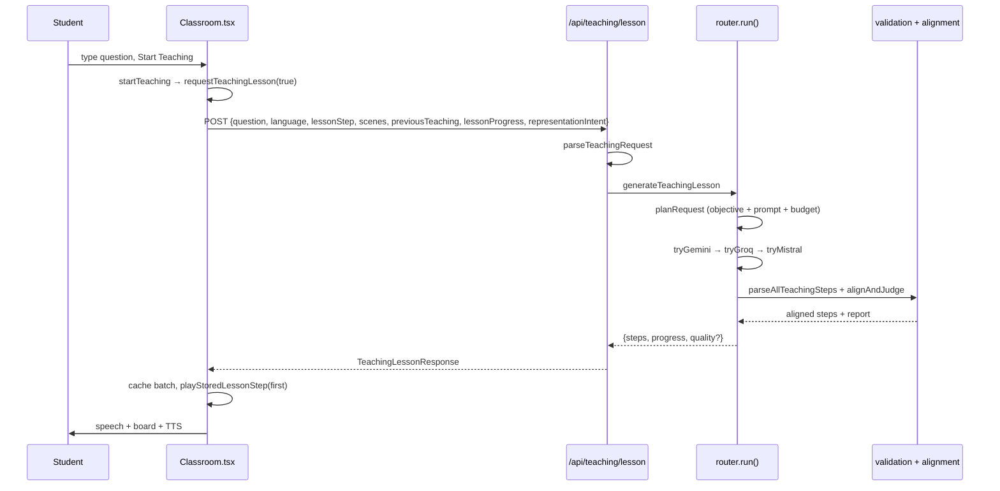

### 18.2 AI provider routing

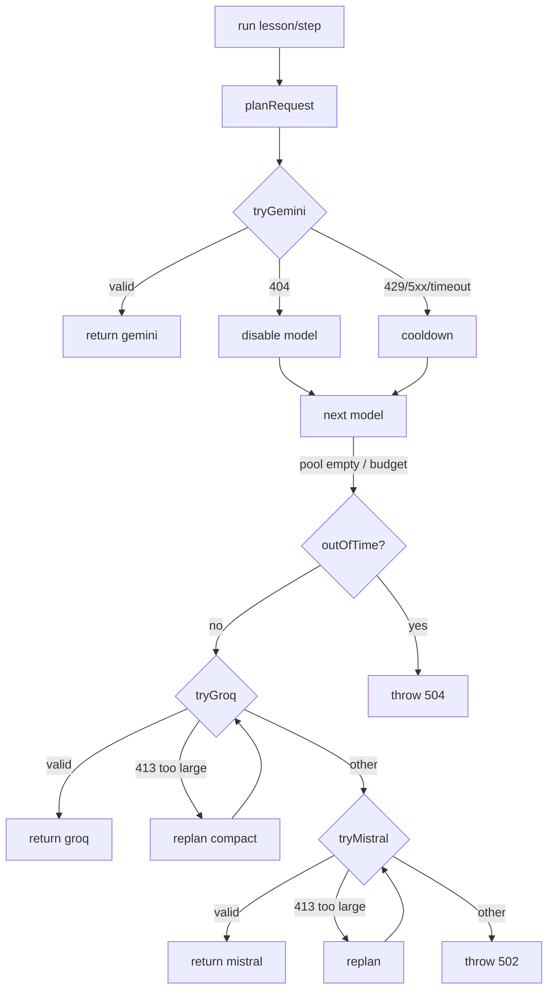

### 18.3 Lesson batch lifecycle

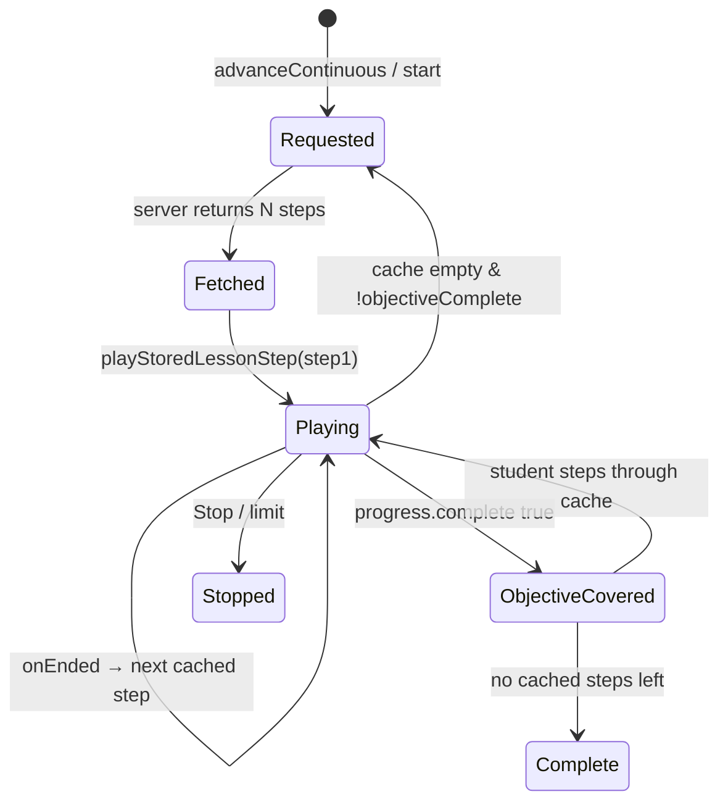

### 18.4 Visual action lifecycle

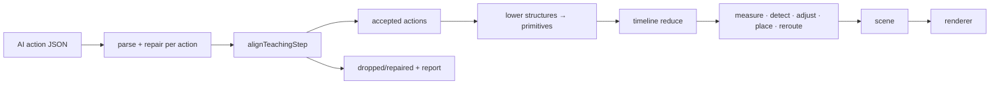


### 18.5 2D rendering pipeline

```mermaid
flowchart TD
  A[VisualAction[]] --> L[compileStructure / lowerVisualActions]
  L --> G[lib/visual/layout.ts measured geometry]
  L --> T[buildTimeline]
  T --> R[applyVisualAction reducer]
  R --> M[measureText / shapeSizeForText]
  M --> C[refreshConnections]
  C --> O[resolveSceneOverlaps]
  O --> P[refreshTextPlacement]
  P --> L2[refreshConnectionLabels]
  L2 --> S[VisualScene]
  S --> D[DiagramRenderer SVG]
```

### 18.6 3D rendering pipeline

```mermaid
flowchart TD
  A[Visual3DAction[]] --> T[buildTimeline]
  T --> R[applyVisual3DAction reducer]
  R --> REL[resolveSceneLayout / resolveRelation]
  REL --> B[boundsFromSceneObjects]
  B --> F{teacher camera action?}
  F -->|no| AF[fitCameraToBounds auto-frame]
  F -->|yes| TC[teacher camera pose]
  AF --> S[Visual3DScene]
  TC --> S
  S --> O[SceneObject + AssetModel GLB]
  S --> FL[FlowParticles]
  S --> AN[SceneAnnotations]
  S --> LB[SceneLabel world→DOM]
  S --> CC[CameraController]
```


### 18.7 TTS lifecycle

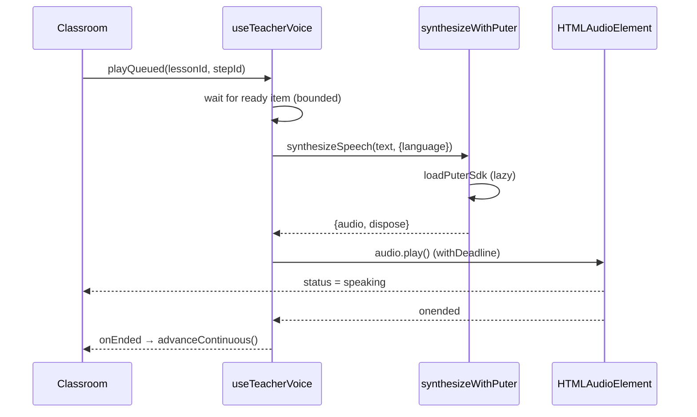

### 18.8 Interruption lifecycle

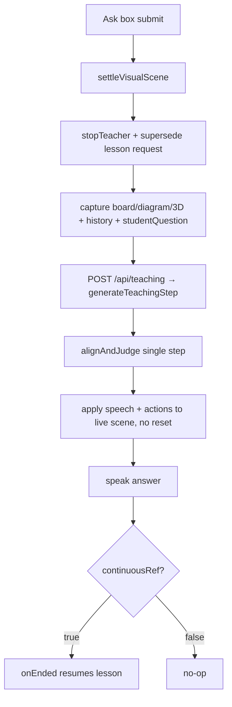

### 18.9 Fallback lifecycle

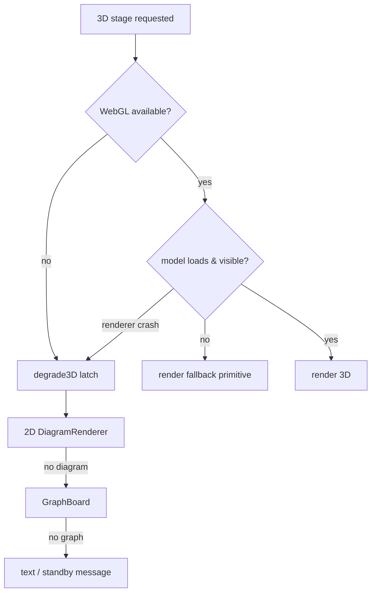

### 18.10 Lesson completion

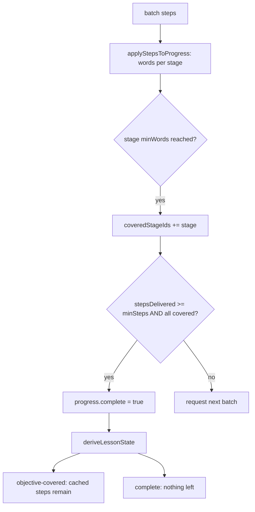


---

## 19. How to modify the system

Each task below lists the exact files. Follow the data flow, not just the file list.

### 19.1 Add a new AI provider

1. `lib/teaching/providers/error.ts` — add the name to `TeachingProviderName`.
2. Create `lib/teaching/providers/<name>.ts` exporting `generateTeachingStepWith<Name>` /
   `generateTeachingLessonWith<Name>`, returning the **shared** `TeachingResponse` /
   `TeachingLessonResponse` and validating with `parseTeachingResponse`/`parseAllTeachingSteps`. Reuse
   the shared schema from `lib/teaching/providers/jsonSchema.ts`.
3. `lib/teaching/providers/router.ts` — add a `try<Name>()` tier and slot it into `run()` (after the
   current last tier). Reuse `planRequest`/`replan`.
4. `app/api/teaching/route.ts` — add the key to `secrets()` so it is redacted from logs.
5. `.env.example` — document the env var.

### 19.2 Add a new visual action

1. `lib/visual/types.ts` (or `lib/visual3d/types.ts`) — extend the action union and the
   `VISUAL_ACTION_TYPES` / `VISUAL3D_ACTION_TYPES` array.
2. `lib/visual/validate.ts` (or `lib/visual3d/validate.ts`) — add the parse case.
3. `lib/teaching/providers/jsonSchema.ts` — the shared wire schema derives from the type arrays, so a
   new field/type must exist there too if it is a new property.
4. `lib/visual/engine.ts` (or `lib/visual3d/engine.ts`) — add the reducer case.
5. `lib/visual/layout.ts`/`geometry.ts` (or `lib/visual3d/layout.ts`/`camera.ts`/`framing.ts`) if it
   needs geometry.
6. `components/visual/DiagramRenderer.tsx` (or `components/visual3d/*`) if it needs new pixels.
7. `lib/teaching/prompt.ts` — add it to the relevant vocabulary section.
8. `lib/teaching/alignment.ts` — if it must be validated against the registry/live scene.
9. Tests in `tests/visual.test.ts` / `tests/visual3d.test.ts`.

### 19.3 Add a new 2D structure

1. `lib/visual/types.ts` — add the layout type + the `create_*` action to `VisualAction`,
   `VISUAL_ACTION_TYPES`, `SEMANTIC_STRUCTURE_ACTIONS`.
2. `lib/visual/layout.ts` — add `compile<Structure>()` and a `compileStructure` case.
3. `lib/visual/validate.ts` — parse the action (the nested payload must be **fully expanded** in
   `jsonSchema.ts`, or structured-output providers delete it — see the jsonSchema comment).
4. `lib/teaching/prompt.ts` — name it in `diagramVocabulary()`.
5. `lib/teaching/alignment.ts` — add it to `structureIds`/`createsObject`/`sceneKindOf`/`wrongStructureKind`.
6. Add a fixture in `lib/visual/demoScenarios.ts` and a row in `scripts/verify-2d-board.mjs`.

### 19.4 Add a new 3D asset

1. Add its geometry to `scripts/lib/models-*.mjs` and its metadata to the `CATALOG` in
   `scripts/build-assets.mjs` (id, name, aliases, fallback, defaultColor, semantic parts).
2. `npm run assets:build` → regenerates `.glb` + `lib/visual3d/generatedAssets.ts`.
3. `npm run assets:validate` and `npm run audit:assets`.
4. Nothing else — the registry, prompt catalogue, selection and concept index all read
   `GENERATED_ASSETS`. Add a `verify-browser.mjs` scenario if it should be gated.

### 19.5 Add a new TTS provider

1. `lib/tts/providers/types.ts` — add the name to `TtsProviderName`.
2. Create `lib/tts/providers/<name>.ts` returning `{ audio: HTMLAudioElement, dispose }`.
3. `lib/tts/providers/index.ts` — register it in `PROVIDERS` and switch `ACTIVE_TTS_PROVIDER`.
`Classroom` and `useTeacherVoice` require no change.

### 19.6 Change lesson progression

- Stage arcs / depth / min-max steps: `lib/teaching/objective.ts` (`SUBJECT_ARCS`, `CONCEPT_ONLY_ARC`,
  `buildStages`, `buildLessonObjective`).
- Depth detection / topic extraction: `lib/teaching/intent.ts`.
- Batch size / "TEACH NOW" prompt text: `objectiveSection` in `lib/teaching/prompt.ts`.
- Completion rule: `isObjectiveComplete` (server) and `deriveLessonState` (client) in `objective.ts`.
- Client auto-advance: `advanceContinuous` in `components/Classroom.tsx`.

### 19.7 Change screen-aware board layout

- 2D geometry/lanes/slots: `lib/visual/geometry.ts`, `lib/visual/layout.ts`, `lib/visual/measure.ts`.
- 2D painting/viewport: `components/visual/DiagramRenderer.tsx`.
- 3D layout/framing/camera: `lib/visual3d/layout.ts`, `framing.ts`, `camera.ts`,
  `components/visual3d/CameraController.tsx`.

### 19.8 Add a new student control

1. Add state/handler in `components/Classroom.tsx`.
2. If it moves steps, reuse `goToStep`/`navigateSteps`; if it changes the stage, reuse
   `chooseVisualMode`; if it changes the lesson, add it next to `startTeaching`/`startNewLesson`.
3. Add the button to the JSX (setup panel or `teacher-live` panel) and a control in `StepRail` or
   `VisualModePicker` if it belongs there.

### 19.9 Add a new teaching quality rule

1. `lib/teaching/quality.ts` — add a `kind` to `TeachingQualityIssue`, a detector in `stepIssues` (or a
   batch check in `alignAndJudge`), and include it in the `severe` filter if it should fail `ok`.
2. `lib/teaching/types.ts` — it flows through `LessonQualitySummary` automatically.
3. Add an assertion in `tests/teaching-alignment.test.ts`.


---

## 20. Current limitations

Honest, code-derived limitations. None of these are hidden in the source.

### 20.1 Provider limitations

- **Gemini availability fluctuates.** `GEMINI_TEACHING_MODELS` is ordered by *measured* availability
  for this project's key (the comments note the larger flash ids sometimes answer 429 and the 2.5 ids
  answered 404). The pool depends on the live `models.list()`, and a 404 disables a model for the
  process (re-probed after 6 h).
- **Groq free tier is token-limited.** The budget (`TOKEN_BUDGET = 7000`, `TOKEN_HARD_LIMIT = 7700`) and
  three compaction levels exist specifically to stay under it; a lesson too large to compact is rejected.
- **Mistral is a last resort** and only runs when both earlier tiers fail.
- Heuristic status classification (`statusOf`) parses status codes out of error messages when the SDK
  does not surface them; it is best-effort.
- `preferJsonObjectMode` (Groq and Mistral) is a **process-level latch**, not persisted — it resets on
  restart.
- **Dead helper:** `isOversizedStatus()` in `router.ts` returns `false` for all input; oversized
  detection is inline in `tryGroq`/`tryMistral`.

### 20.2 3D asset quality

- Assets are **procedurally generated** glTF (`scripts/build-assets.mjs`), normalized to radius ~1.
- `npm run audit:assets` grades educational fidelity: some assets are intrinsic C ("primitive / poor
  educational representation") where the subject itself is simple, and complex structures depend on how
  many distinct named parts were authored.
- `isolate_part` / `explode_group` / `set_visibility` on a model **whose parts were not authored as
  separate named nodes** are silent no-ops (documented in `AssetModel.tsx`).
- `validateObject3D` treats "loaded but invisible" as a failure — a mis-scaled or empty mesh falls back
  to a primitive.

### 20.3 TTS limitations

- Puter.js is **client-side and keyless** ("User-Pays"): speech depends on the browser reaching
  `https://js.puter.com/v2/` and on the user being able to use Puter. There is **no server TTS fallback**
  and no `SpeechSynthesis` fallback.
- `PUTER_TEXT_LIMIT = 3000` characters per utterance; no `AbortSignal` support (`TtsSynthesizeOptions.signal`
  is documented as reserved).
- The voice is **fixed** (`PUTER_TTS_CONFIG.voice = "Puck"`); language is an instruction, not a separate
  voice.
- Voice failures are non-blocking: the step's text stays on screen and the sync watchdog advances.

### 20.4 Browser / dev-server / test-runner issues

- Acceptance scripts default to different ports (`verify-browser.mjs` → `:3001`; `verify-lessons.mjs` /
  `probe-lessons.mjs` → `:3000`) and a hardcoded Chrome path (`CHROME` env overridable). They are
  environment-dependent and are **not** part of `npm test`.
- The deterministic scenario / mock routes exist **only** when `NODE_ENV !== "production"`.
- Real lessons require `.env.local` with at least one provider key; without any, the API returns `503`.

### 20.5 Visual composition limitations

- The stage renders **one** family per lesson (`plan.representation`); the other family's actions are
  deleted by alignment. A request for a representation the lesson has no content for is overridden, with
  an on-screen notice (2D request over a 3D-only step).
- 2D board size is fixed (`DIAGRAM_WIDTH × DIAGRAM_HEIGHT`); very large structures are truncated at
  `MAX_OBJECTS = 120` with a repair diagnostic, and 3D at `MAX_3D_OBJECTS = 60`.
- 3D auto-framing uses a single enclosing sphere; a very elongated scene frames to its widest extent.

### 20.6 Missing student features (NOT IMPLEMENTED)

- No student-authored annotations, highlights, drawings or notes on the board.
- No per-object drag/edit of a drawn diagram.
- No saved/history/library of past lessons.
- The pre-lesson "starter topics" are a static curated list (`components/visual/StarterTopics.tsx`), not
  personalised.

### 20.7 Internal caps & tests

- Client safety cap `MAX_CONTINUOUS_STEPS = 80` in `Classroom.tsx` and `objective.maxSteps = 60` for a
  deep lesson: a lesson cannot be longer than this even if stages remain.
- `npm test` proves engine/planning/alignment/board correctness only; it never runs a provider, a
  browser, or WebGL. The `verify:*` scripts are the ones that exercise the real experience, and they are
  not run by `npm test`.

---

## Appendix A — Verification status

At the time of writing, `npm test` passes all six suites (283 + 280 + 72 + 103 + 111 + 54 = 903
assertions, 0 failures). Every file, symbol, and diagram in this document was cross-checked against the
repository at that revision: all referenced paths exist, all referenced function/type names occur in
source, and the Mermaid diagrams reflect the real call order in `router.ts`, `Classroom.tsx`,
`lib/visual/engine.ts` and `lib/visual3d/engine.ts`.

